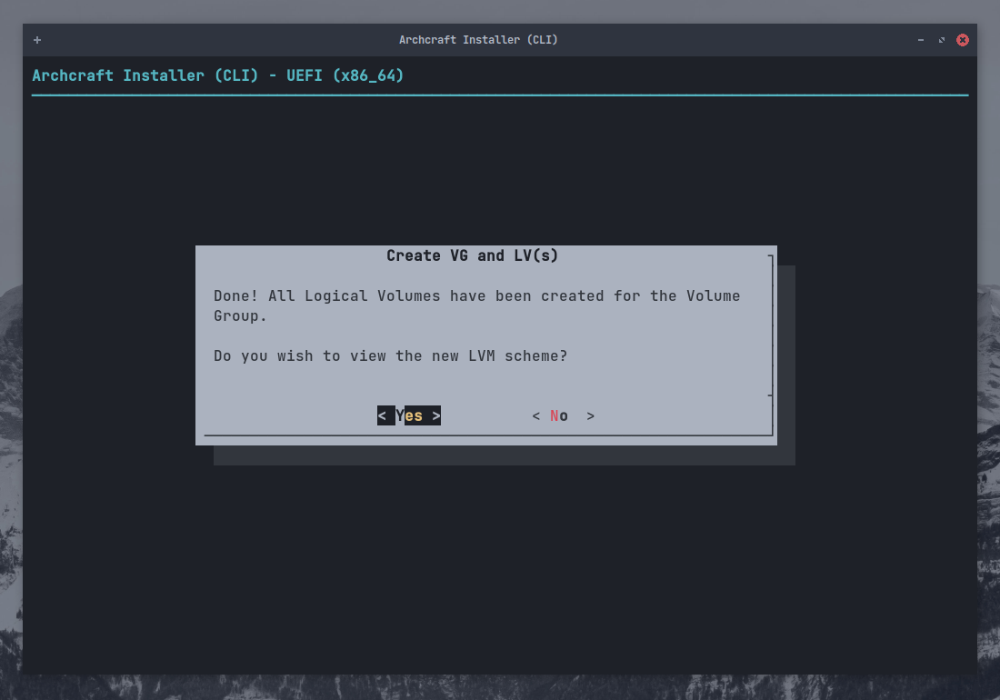
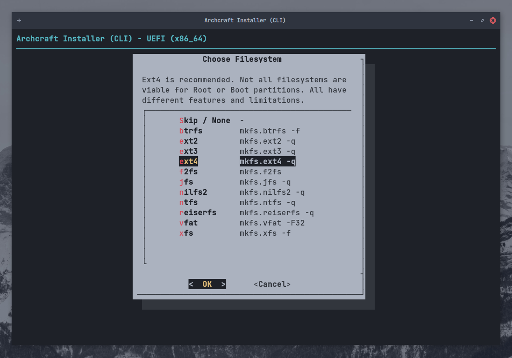

---
title: Installer Archcraft avec ABIF
created: '2021-10-09T12:00:32.635Z'
modified: '2021-10-09T13:59:14.452Z'
---

# Installer Archcraft avec ABIF

**`ABIF`** est le 2éme installeur sur Archcraft, Il est sous terminal et trés puissant. On expecte les gens qui savent ce qu'ils font d'utiliser cet installeur pour installer Archcraft.
> *On recommende pas d'utiliser cet installeur pour des débutants, Utilisez [Calamares](./install-with-calamares) à la place.* 
*Mais si vous voulez continuer avec cette méthode, continuez à lire.*

Dans ce guide, je vais installer Archcraft sur un système UEFI avec `Encryption` et `LVM` en utilisant **`ABIF`**. 
Le processus sera le même si vous utilisez le BIOS.

Je suppose que vous avez déjà créé une [USB bootable](../boot-iso/boot-with-usb) avec l'ISO d'Archcraft.
sélectionnez **Boot Archcraft**. Lancez l'installateur via l'app de bienvenue ou le menu.

Sélectionnez la langue de l'installateur et appuyez sur <kbd>Enter</kbd>.

### Préparer l'installation

Sélectionnez `Préparez l'installation` et appuyez sur <kbd>Enter</kbd>.

Sélectionnez `Set Virtual Console`, choisissez votre disposition et appuyez sur <kbd>Enter</kbd>.

Sélectionnez `Set Desktop Keyboard Layout`, choisissez votre disposition et appuyez sur <kbd>Enter</kbd>.

### Partitionner le disque

Sélectionnez `List Devices` et appuyez sur <kbd>Enter</kbd>.

Ici, Vous pouvez voir les disques et partitions disponibles sur votre système.

Si votre disque est déjà partitionné, vous pouvez sauter cette étape et passer à :

- [Setup LUKS](#setup-luks-encryption) (*Si vous voulez utiliser `Encryption`*)
- [Setup LVM](#setup-lvm) (*Si vous voulez configurer `LVM`*)
- Mount Partitions](#mount-partitions) (*Si vous voulez juste une installation normale*)

Si vous voulez faire le partitionnement, sélectionnez `Partition Disk` et appuyez sur <kbd>Enter</kbd>.

Sélectionnez `Votre disque` et appuyez sur <kbd>Entrée</kbd>.

Choisissez n'importe quel utilitaire de partitionnement (* En utilisant `gparted` ici*) et appuyez sur <kbd>Enter</kbd>

Faites le partitionnement et quand vous avez terminé, quittez `gparted`.

:::caution

Si votre système a déjà une partition EFI, assurez-vous qu'elle a au moins `100MB de stockage libre`, ou l'installation échouera.
:::

### Configuration du chiffrement LUKS

Si vous ne voulez pas utiliser **Disk Encryption**, vous pouvez sauter cette étape et passer à :

- [Setup LVM](#setup-lvm) (*Si vous souhaitez configurer `LVM`*)
- Monter les partitions](#mount-partitions) (*Si vous ne voulez pas utiliser `LVM`*)

Si vous voulez utiliser **Disk Encryption**, sélectionnez `LUKS Encryption` et appuyez sur <kbd>Enter</kbd>.

Je vais juste aller avec `LUKS automatique` mais si vous avez des préférences, Utilisez cela et appuyez sur <kbd>Enter</kbd>.

Sélectionnez la partition que vous voulez crypter (*Je vais crypter root qui est `/dev/sda2`*) et appuyez sur <kbd>Enter</kbd>.

Entrez le nom pour le `Dispositif de bloc crypté` et appuyez sur <kbd>Enter</kbd>.

Tapez un `mot de passe` fort et appuyez sur <kbd>Enter</kbd>, Recommencez.

Vous pouvez revoir votre configuration LUKS ici. Quand vous avez terminé, appuyez sur <kbd>Enter</kbd> pour sortir.

Répétez le processus pour crypter d'autres partitions (*par ex : `/home`*).
Lorsque vous avez terminé, sélectionnez `Back` et appuyez sur <kbd>Enter</kbd>.

### Configurer LVM

Si vous ne voulez pas configurer **Logical Volumes**, Vous pouvez sauter cette étape et passer à [Mount Partitions](#mount-partitions). 
Si vous le faites, sélectionnez `Gestion des volumes logiques` et appuyez sur <kbd>Entrée</kbd>.

Créez d'abord un **Groupe de volumes**, Sélectionnez `Créer un VG et un ou des LV(s)` et appuyez sur <kbd>Entrée</kbd>.

Entrez le nom du `groupe` et appuyez sur <kbd>Enter</kbd>.

Sélectionnez les `Partitions` (*utiliser <kbd>SPACE</kbd>*) que vous voulez ajouter au groupe LV et appuyez sur <kbd>Enter</kbd>.

Appuyez sur <kbd>Enter</kbd> pour confirmer la création du groupe.

Vous obtiendrez un dialogue, confirmant que le groupe a été créé. Appuyez sur <kbd>Enter</kbd> pour quitter.

Sélectionnez le `Nombre` de volumes dans le groupe (*Nous avons choisi deux partitions à ajouter dans le groupe plus tôt*) et appuyez sur <kbd>Enter</kbd>.

Entrez le nom du premier LV (*pour `root`*) et appuyez sur <kbd>Enter</kbd>

Entrez la taille de la `LV` et appuyez sur <kbd>Enter</kbd>.

Vous verrez que le LV a été créé. Appuyez sur <kbd>Enter</kbd> pour sortir.

Faites la même chose pour le deuxième LV, Entrez le nom et appuyez sur <kbd>Enter</kbd>. La taille sera sélectionnée automatiquement.

Appuyez sur <kbd>Enter</kbd> pour voir votre schéma LVM.

Lorsque vous avez terminé et appuyez sur <kbd>Enter</kbd> pour quitter.

### Monter les partitions

Maintenant que nous avons configuré les partitions, (*Encryptage et LVM*). Il est temps de les monter pour l'installation.

Sélectionnez `Mount Partitions` et appuyez sur <kbd>Enter</kbd>.

Sélectionnez la `Root Partition` et appuyez sur <kbd>Enter</kbd>. Gardez à l'esprit que :

- Si vous configurez **LVM** (*avec cryptage*), choisissez cela pour `root` (*par ex : dans cette configuration **/dev/mapper/archcraft-lvol_root** sera la racine*).
- Si vous avez configuré **Cryptage** seulement (*pas de LVM*), choisissez cela pour `root` (*dev/mapper/cryptroot*)
- Si vous n'avez pas configuré *Encryptage* ou *LVM*, choisissez `root` normalement (*/dev/sda2*)

Sélectionnez `ext4` comme système de fichiers (*vous pouvez choisir tout autre type de fs*) et appuyez sur <kbd>Enter</kbd>.

Sélectionnez `Yes` et appuyez sur <kbd>Enter</kbd> pour formater la partition, Ignorez les autres trucs.

Si vous avez mis en place une **Partition de remplacement**, vous pouvez la monter ici. Vous pouvez aussi utiliser un `Swapfile` si vous voulez.
Sélectionnez ce que vous préférez et appuyez sur <kbd>Entrée</kbd>.

Maintenant, montez la partition `boot`. Sélectionnez votre partition `EFI` (*/dev/sda1*) et appuyez sur <kbd>Enter</kbd>.

:::danger

Votre système peut déjà avoir une partition **EFI**. Dans ce cas **`NE LA FORMATTEZ PAS`** ou vous ne pourrez pas démarrer sur les autres OS installés (Disons windows) .
Montez simplement la partition EFI dans `/boot`.

:::

Sélectionnez `No` si vous ne voulez pas formater la partition EFI et appuyez sur <kbd>Enter</kbd>.

Sélectionnez `/boot` comme point de montage et appuyez sur <kbd>Enter</kbd>.

Et, maintenant vous pouvez monter le reste des partitions (*par ex : /home*) ici. Sélectionnez-le et appuyez sur <kbd>Enter</kbd>

Encore une fois, sélectionnez `ext4` (*ou tout autre*) comme FS et appuyez sur <kbd>Enter</kbd>.

Entrez le `point de montage` pour la partition et et appuyez sur <kbd>Enter</kbd>.

Lorsque vous avez fini de monter toutes les partitions, sélectionnez `Done` et appuyez sur <kbd>Enter</kbd> pour sortir.

Sélectionnez `Back` et appuyez sur <kbd>Enter</kbd> pour aller à l'installation.

### Installer la base

Maintenant que toutes les partitions sont montées et prêtes, installons les **`Paquets Base``.

Sélectionnez `Install Base` et appuyez sur <kbd>Enter</kbd>.

Sélectionnez `Installer les paquets de base` et appuyez sur <kbd>Enter</kbd>.

Attendez que l'installation soit terminée. En attendant, [Lighten Up Your Mood...](https://youtu.be/dQw4w9WgXcQ?t=5)

Après que l'installation soit faite, Sélectionnez `Run Mkinitcpio` et appuyez sur <kbd>Enter</kbd>

Cela va générer les fichiers **initramfs-linux** et **initramfs-linux-fallback**.

Sélectionnez `Install Bootloader` et appuyez sur <kbd>Enter</kbd>.

Sélectionnez `grub` comme chargeur de démarrage et appuyez sur <kbd>Enter</kbd>.

Sélectionnez `Yes` pour que *grub* soit le chargeur de démarrage par défaut et appuyez sur <kbd>Enter</kbd>.

Sélectionnez `Back` et appuyez sur <kbd>Enter</kbd> pour quitter l'installation.

### Configurer la base

Archcraft est installé sur votre système. Il est temps de configurer votre installation.

Sélectionnez `Configurer la base` et appuyez sur <kbd>Enter</kbd>.

Sélectionnez `Générer FSTAB` et appuyez sur <kbd>Enter</kbd>.

Sélectionnez `Part UUID` pour **UEFI** et `Device UUID` pour **BIOS** et appuyez sur <kbd>Enter</kbd>.

Sélectionnez `Set Hostname` et appuyez sur <kbd>Enter</kbd>.

Entrez le `nom d'hôte` de votre système et appuyez sur <kbd>Enter</kbd>.

Sélectionnez `Set System Locale` et appuyez sur <kbd>Enter</kbd>.

Sélectionnez la locale que vous voulez utiliser (*`en_US.UTF-8` pour l'anglais américain*) et appuyez sur <kbd>Enter</kbd>.

Sélectionnez `Set Timezone and Clock` et appuyez sur <kbd>Enter</kbd>.

Sélectionnez votre `Fuseau horaire` (par exemple : *`ASIA`*) et appuyez sur <kbd>Enter</kbd>.

Sélectionnez votre `Région` (ex : *`Kolkata`*) et appuyez sur <kbd>Enter</kbd>.

Sélectionnez `Oui` et appuyez sur <kbd>Entrée</kbd>.

Sélectionnez `utc` et appuyez sur <kbd>Enter</kbd>.

:::info

Pour le double démarrage avec Windows, il est recommandé de [configurer Windows pour qu'il utilise l'UTC] (https://wiki.archlinux.org/title/System_time#UTC_in_Microsoft_Windows),
plutôt que Linux pour utiliser l'heure locale. (*Windows utilise par défaut l'heure locale*)

:::

Sélectionnez `Set Root Password` pour définir un mot de passe pour **root** et appuyez sur <kbd>Enter</kbd>.

Sélectionnez `Add New User(s)` pour créer un ou plusieurs nouveaux comptes utilisateurs et appuyez sur <kbd>Enter</kbd>.

Entrez `username` et appuyez sur <kbd>Enter</kbd>.

Saisissez `mot de passe` pour votre compte utilisateur et appuyez sur <kbd>Enter</kbd>. Confirmez le mot de passe.

Sélectionnez `Security and systemd Tweaks` pour régler ces trucs (*Si vous savez quoi faire*) et appuyez sur <kbd>Enter</kbd>.

Lorsque vous avez terminé, sélectionnez `Back` et appuyez sur <kbd>Enter</kbd> pour sortir.

### Revoir les fichiers de configuration

Sélectionnez `Review Configuration Files` et appuyez sur <kbd>Enter</kbd>.

Sélectionnez le `fichier` que vous voulez visualiser et appuyez sur <kbd>Enter</kbd>. Lorsque vous avez terminé, sélectionnez `Back` pour quitter.

### Terminer

Tout est terminé... Vous pouvez maintenant **`Quitter le programme d'installation`** et redémarrer le système.

Sélectionnez `Done` et appuyez sur <kbd>Enter</kbd>.

Sélectionnez `Yes` et appuyez sur <kbd>Enter</kbd> pour quitter.

Redémarrez dans votre système nouvellement installé.

**Et voilà, c'est fait ! Archcraft est installé sur votre système. Profitez-en !**
