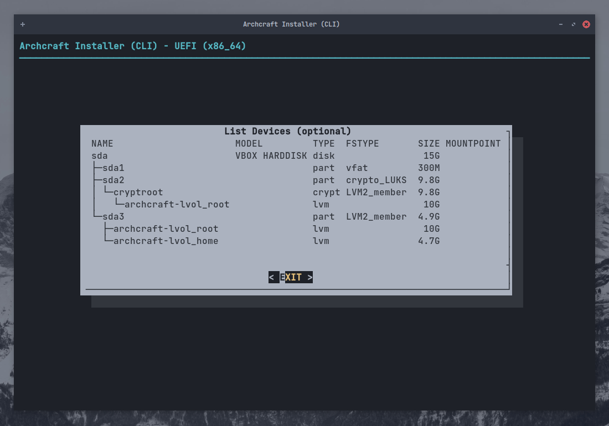

# Install Archcraft With ABIF

**`ABIF`** is the secondary installer in Archcraft, It is based on the command line and very powerful (*I personally use it*).
It is expected that the people who use this installer to install Archcraft, know what they are doing.

> *I won't recommend using this installer if you're a beginner, Use [Calamares](./install-with-calamares) instead.* 
*But if you still want to use this installer, You can follow this guide.*

In this guide, I'll be installing Archcraft on an UEFI system with `Encryption` and `LVM` by using **`ABIF`**. 
The process will be the same if you are using BIOS.

I'm assuming that you have already created a [bootable USB](../boot-iso/boot-with-usb) with Archcraft ISO, boot system with it and
select **Boot Archcraft**. Launch the installer via either welcome app or menu.

Select the installer language and press <kbd>Enter</kbd>

### Prepare Installation

Select `Prepare Installation` and press <kbd>Enter</kbd>

Select `Set Virtual Console`, Choose your layout and press <kbd>Enter</kbd>

Select `Set Desktop Keyboard Layout`, Choose your layout and press <kbd>Enter</kbd>

### Partition Disk

Select `List Devices` and press <kbd>Enter</kbd>

Here, You can see available disks and partitions on your system.

If your disk is already partitioned, you can skip this and move to :

- [Setup LUKS](#setup-luks-encryption) (*If you want to use `Encryption`*)
- [Setup LVM](#setup-lvm) (*If you want to setup `LVM`*)
- [Mount Partitions](#mount-partitions) (*If you just want a normal installation*)

If you want to do the partitioning, Select `Partition Disk` and press <kbd>Enter</kbd>

Select `Your Disk` and press <kbd>Enter</kbd>

Choose any partitioning utility (* Using `gparted` here*) and press <kbd>Enter</kbd>

Do the partitioning and when you're done, exit `gparted`

:::caution

If your system already has an EFI partition, Make sure it has at least `100MB of free storage`, or the installation will fail.

:::

### Setup LUKS Encryption

If you don't want to use **Disk Encryption**, You can skip this and move to :

- [Setup LVM](#setup-lvm) (*If you want to setup `LVM`*)
- [Mount Partitions](#mount-partitions) (*If you don't want to use `LVM`*)

If you want to use **Disk Encryption**, Select `LUKS Encryption` and press <kbd>Enter</kbd>

I'll just go with `Automatic LUKS` but if you have preferences, Use that and press <kbd>Enter</kbd>

Select the partition you want to encrypt (*I'll encrypt root which is `/dev/sda2`*) and press <kbd>Enter</kbd>

Enter the name for `Encrypted block device` and press <kbd>Enter</kbd>

Type a strong `password` and press <kbd>Enter</kbd>, Do it again.

You can review your LUKS setup here. When done, press <kbd>Enter</kbd> to exit

Repeat the process to encrypt other partitions (*for ex : `/home`*).
When you're done, Select `Back` and press <kbd>Enter</kbd>

### Setup LVM

If you don't want to set up **Logical Volumes**, You can skip this and move to [Mount Partitions](#mount-partitions). 
If you do, Select `Logical Volume Management` and press <kbd>Enter</kbd>

Create a **Volume Group** first, Select `Create VG and LV(s)` and press <kbd>Enter</kbd>

Enter the name of the `group` and press <kbd>Enter</kbd>

Select the `Partitions` (*use <kbd>SPACE</kbd>*) you want to add to the LV group and press <kbd>Enter</kbd>

Press <kbd>Enter</kbd> to confirm the creation of the group.

You'll get a dialog, confirming that the group has been created. press <kbd>Enter</kbd> to exit.

Select the `Numbers` of volumes in the group (*We choose two partition to add in the group earlier*) and press <kbd>Enter</kbd>

Enter the name of first LV (*for `root`*) and press <kbd>Enter</kbd>

Enter the size of the `LV` and press <kbd>Enter</kbd>

You'll see that the LV has been created. press <kbd>Enter</kbd> to exit.

Do the same for the second LV, Enter name and press <kbd>Enter</kbd>. The size will be selected automatically.

Press <kbd>Enter</kbd> to view your LVM scheme.

When you're done and press <kbd>Enter</kbd> to exit.

### Mount Partitions

Now that we have set up Partitions, (*Encryption and LVM*). It's time to mount them for installation.

Select `Mount Partitions` and press <kbd>Enter</kbd>

Select the `Root Partition` and press <kbd>Enter</kbd>. Keep in mind that :

- If you setup **LVM** (*with encryption*), choose that for `root` (*for ex : in this setup **/dev/mapper/archcraft-lvol_root** will be the root*)
- If you setup **Encryption** only (*no LVM*), choose that for `root` (*/dev/mapper/cryptroot*)
- If you've not setup *Encryption* or *LVM*, choose `root` normally (*/dev/sda2*)

Select `ext4` as file system (*you can choose any other fs type*) and press <kbd>Enter</kbd>

Select `Yes` and press <kbd>Enter</kbd> to format the partition, Ignore other stuff.

If you have set up a **Swap Partition**, You can mount it here. You can also use a `Swapfile` if you want.
Select whatever you prefer and press <kbd>Enter</kbd>

Now, Mount the `boot` partition. Select your `EFI partition` (*/dev/sda1*) and press <kbd>Enter</kbd>

:::danger

Your system may already have an **EFI** partition. In that case **`DO NOT FORMAT IT`** or you won't be able to boot into other installed OS (Let's say windows) 
Just mount the EFI partition to `/boot`

:::

Select `No` if you don't want to format the EFI partition and press <kbd>Enter</kbd>

Select `/boot` as mount point and press <kbd>Enter</kbd>

And, Now you can mount the rest of the partitions (*for ex: /home*) here. Select it and press <kbd>Enter</kbd>

Again, Select `ext4` (*or any other*) as FS and press <kbd>Enter</kbd>

Enter the `mount point` for the partition and and press <kbd>Enter</kbd>

When you're done mounting all the partitions, Select `Done` and press <kbd>Enter</kbd> to exit

Select `Back` and press <kbd>Enter</kbd> to go to Installation.

### Install Base

Now all the partitions are mounted and ready, Let's install the **`Base packages`**

Select `Install Base` and press <kbd>Enter</kbd>

Select `Install Base Packages` and press <kbd>Enter</kbd>

Wait for the installation to complete. In the meantime, [Lighten Up Your Mood...](https://youtu.be/dQw4w9WgXcQ?t=5)

After the installation is done, Select `Run Mkinitcpio` and press <kbd>Enter</kbd>

This will generate the **initramfs-linux** and **initramfs-linux-fallback**.

Select `Install Bootloader` and press <kbd>Enter</kbd>

Select `grub` as bootloader and press <kbd>Enter</kbd>

Select `Yes` to make *grub* default bootloader and press <kbd>Enter</kbd>

Select `Back` and press <kbd>Enter</kbd> to exit installation.

### Configure Base

Archcraft is installed on your system. It's time to configure your installation.

Select `Configure Base` and press <kbd>Enter</kbd>

Select `Generate FSTAB` and press <kbd>Enter</kbd>

Select `Part UUID` for **UEFI** and `Device UUID` for **BIOS** and press <kbd>Enter</kbd>

Select `Set Hostname` and press <kbd>Enter</kbd>

Enter the `hostname` for your system and press <kbd>Enter</kbd>

Select `Set System Locale` and press <kbd>Enter</kbd>

Select the locale you want to use (*`en_US.UTF-8` for US English*) and press <kbd>Enter</kbd>

Select `Set Timezone and Clock` and press <kbd>Enter</kbd>

Select your `Time Zone` (eg : *`ASIA`*) and press <kbd>Enter</kbd>

Select your `Region` (eg : *`Kolkata`*) and press <kbd>Enter</kbd>

Select `Yes` and press <kbd>Enter</kbd>

Select `utc` and press <kbd>Enter</kbd>

:::info

To dual boot with Windows it is recommended to [configure Windows to use UTC](https://wiki.archlinux.org/title/System_time#UTC_in_Microsoft_Windows),
rather than Linux to use localtime. (*Windows by default uses localtime*)

:::

Select `Set Root Password` to set a password for **root** and press <kbd>Enter</kbd>

Select `Add New User(s)` to create new user account(s) and press <kbd>Enter</kbd>

Enter `username` and press <kbd>Enter</kbd>

Enter `password` for your user account and press <kbd>Enter</kbd>. Confirm the password.

Select `Security and systemd Tweaks` to tweak that stuff (*If you know what to do*) and press <kbd>Enter</kbd>

When you're done, Select `Back` and press <kbd>Enter</kbd> to exit.

### Review Config files

Select `Review Configuration Files` and press <kbd>Enter</kbd>

Select the `file` you want to view and press <kbd>Enter</kbd>. When you're done, Select `Back` to exit.

### Finish

Everything is completed... You can now **`Quit the installer`** and reboot the system.

Select `Done` and press <kbd>Enter</kbd>

Select `Yes` and press <kbd>Enter</kbd> to quit.

Reboot into your newly installed system.

**Well, That’s it! Archcraft is installed on your system. Enjoy!**
