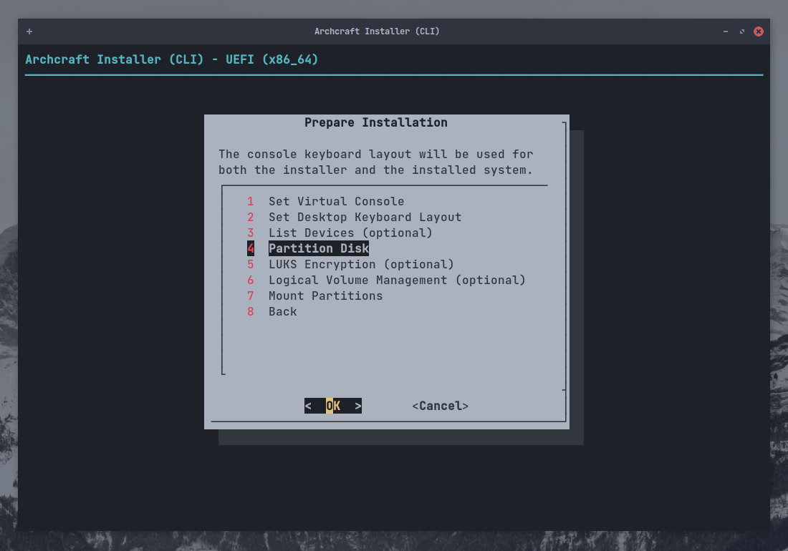
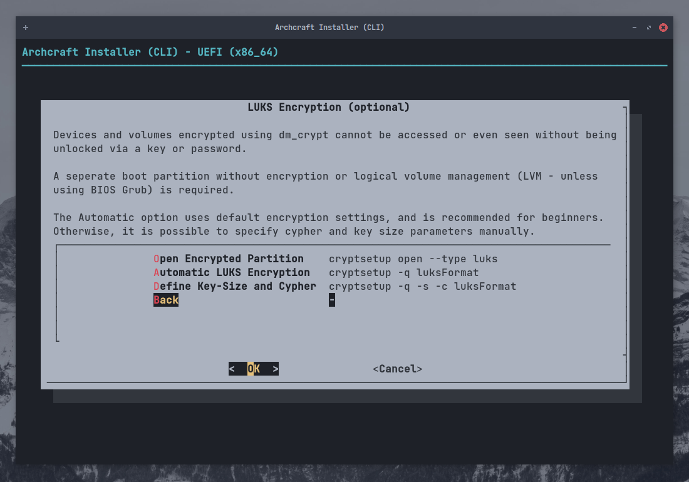

# Zainstaluj Archcrafta wykorzystując ABIF

**`ABIF`** jest drugim instalatorem Archcrafta, opiera się on na wierszu poleceń i jest bardzo wydajny (*Osobiście go używam*).
Osoby, którzy chcą go użyć do instalacji Archcrafta, powinne wiedzieć co robią.

> *Nie polecam używania tego instalatora, jeżeli jesteś początkującym, zamiast tego użyj [Calamares](./install-with-calamares).* 
*Jeśli jednak nadal chcesz użyć tego instalatora, możesz skorzystać z poniższego poradnika.*

W tym poradniku będę instalował Archcrafta na systemie UEFI z `Szyfrowaniem` i `LVM` przy użyciu **`ABIF`**. 
Proces będzie taki sam jeśli używasz BIOSu.

Zakładam, że utworzyłeś już [bootowalne urządzenie USB](../boot-iso/boot-with-usb) z ISO Archcrafta. Uruchom Archcrafta używając bootowalnego USB, wybierz opcję **Boot Archcraft** *(Uruchom Archcrafta)*. Następnie uruchom instalator przez aplikację powitalną lub menu.

Wybierz język instalatora i kliknij przycisk <kbd>Enter</kbd>

### Przygotowanie instalacji

Wybierz `Prepare Installation` *(Przygotuj instalację)*  i kliknij przycisk <kbd>Enter</kbd>

Wybierz `Set Virtual Console` *(Ustaw konsolę wirtualną)*, wybierz swój układ i kliknij przycisk <kbd>Enter</kbd>

Wybierz `Set Desktop Keyboard Layout` *(Ustaw układ klawiatury pulpitu)*, wybierz swój układ i kliknij przycisk <kbd>Enter</kbd>

### Partycjonowanie dysku

Wybierz `List Devices` *(Listę urządzeń)* i kliknij przycisk <kbd>Enter</kbd>

W tym miejscu możesz zobaczyć dostępne dyski i partycje swojego systemu.

Jeśli twój dysk jest już podzielony na partycje, możesz to pominąć i przejść do:

- [Konfiguracji szyforwania LUKS](#konfiguracja-szyfrowania-luks) (*Jeżeli chcesz używać  `Encryption` (Szyfrowania)*)
- [Konfiguracji LVM](#konfiguracja-lvm) (*Jeżeli chcesz używać `LVM`*)
- [Montowanie partycji](#montowanie-partycji) (*Jeśli chcesz normalnie zainstalować*)

Jeśli chcesz dokonać partycjonowania, wybierz `Partition Disk` *(Partycjonowanie dysku)* i kliknij przycisk <kbd>Enter</kbd>

Wybierz `Your Disk` *(Twój dysk)* i kliknij przycisk <kbd>Enter</kbd>

Wybierz dowolne narzędzie do partycjonowania (*w tym poradniku używam `gparted`*) i kliknij przycisk <kbd>Enter</kbd>

Wykonaj partycjonowanie, a kiedy skończysz, wyjdź z `gparted`

:::caution Uwaga

Jeśli twój system ma już partycję EFI, upewnij się, że ma co najmniej `100 MB wolnego miejsca`, w przeciwnym razie instalacja się nie powiedzie.

:::

### Konfiguracja szyfrowania LUKS

Jeśli nie chcesz używać **Szyfrowania Dysku**, możesz to pominąć i przejść do:

- [Konfiguracji LVM](#konfiguracja-lvm) (*Jeżeli chcesz używać `LVM`*)
- [Montowania partycji](#montowanie-partycji) (*Jeśli chcesz normalnie zainstalować*)

Jeśli chcesz używać **Szyfrowania Dysku**,  Wybierz `LUKS Encryption` *(szyfrowanie LUKS)* i kliknij przycisk <kbd>Enter</kbd>

Ja po prostu użyję `Automatic LUKS Encryption` *(Automatyczne szyfrowanie LUKS)*, ale ty jeśli chcesz wprowadźić zmiany, zrób to tutaj i kliknij przycisk <kbd>Enter</kbd>

Wybierz partycję która chcesz zaszyfrować  (*Ja zaszyfruję partycję root (`/dev/sda2`)*) i kliknij przycisk <kbd>Enter</kbd>

Wprowadź nazwę dla `Encrypted block device` *(Zaszyfrowane urządzenie blokowe)* i kliknij przycisk <kbd>Enter</kbd>

Ustaw silne `hasło` i kliknij przycisk <kbd>Enter</kbd>, potwierdź hasło i kliknij przycisk <kbd>Enter</kbd>. 

Możesz tutaj przejżeć swoją konfigurację LUKS. Po zakończeniu kliknij przcisk <kbd>Enter</kbd>, aby wyjść.

Powtórz ten proces, aby zaszyfrować pozostałe partycje  (*na przykład: `/home`*).
Kiedy skończysz, wybierz `Back` *(Powrót)* i kliknij przycisk <kbd>Enter</kbd>

### Konfiguracja LVM

Jeżeli nie chcesz skonfigurować **Woluminów logicznych**, możesz pominąć ten krok i przejśc do [Montowania Partycji](#montowanie-partycji). 
Jeśli jednak chesz dokonać ich konfiguracji, wybierz `Logical Volume Management` *(Zarządzanie logicznymi woluminami)* i kliknij przycisk <kbd>Enter</kbd>

Stwórz **Grupę woluminów**, wybierz `Create VG and LV(s)` *(Stwórz VG i LV)* i kliknij przycisk <kbd>Enter</kbd>

Wprowadż nazwę `grupy` i kliknij przycisk <kbd>Enter</kbd>

Wybierz `Partycję` (*użyj <kbd>SPACE</kbd>* *(SPACJI)*), którą chcesz dodać do grupy LV i kliknij przycisk <kbd>Enter</kbd>

Naciśnij <kbd>Enter</kbd>, aby potwierdzić tworzenie grupy.

Pojawi się okno dialogowe potwierdzające, że grupa została utworzona. naciśnij <kbd>Enter</kbd>, aby wyjść.

Wybierz `Liczbę` woluminów w grupie (*wcześniej wybraliśmy dwie partycje do dodania do grupy*) i kliknij przycisk <kbd>Enter</kbd>

Wprowadź nazwę pierwszego LV (*dla `roota`*) i kliknij przycisk <kbd>Enter</kbd>

Wprowadź rozmiar `LV` i kliknij przycisk <kbd>Enter</kbd>

Zobaczysz, że LV został utworzony, naciśnij klawisz <kbd>Enter</kbd>, aby wyjść.

Zrób to samo dla drugiego LV, wpisz nazwę i kliknij przycisk <kbd>Enter</kbd>. Rozmiar zostanie automatycznie zmniejszony.

Naciśnij <kbd>Enter</kbd>, aby zobaczyć swój schemat LVM.

Kiedy skończysz, kliknij przycisk <kbd>Enter</kbd>, aby wyjść.

### Montowanie partycji

Teraz, gdy mamy już skonfigurowane partycje *(Szyfrowanie i LVM)*. Nadszedł czas, aby zmountować je w celu instalacji.

Wybierz `Mount Partitions` *(Montowanie partycji)* i kliknij przycisk <kbd>Enter</kbd>

Wybierz `Root Partition` *(Partycję Root)* i kliknij przycisk <kbd>Enter</kbd>. Pamiętaj, że:

- Jeżeli skonfigurowałeś **LVM** (*z szyfrowaniem*), wybierz to dla `roota` (*na przykład: w tej konfiguracji **/dev/mapper/archcraft-lvol_root** będzie rootem*)
- Jeżeli skonfigurowałeś **Szyfrowanie** bez (*LVM*), wybierz to dla `roota` (*/dev/mapper/cryptroot*)
- Jeżeli nie skonfigurowałeś *Szyfrowania* lub *LVM*, wybierz `roota` normalnie (*/dev/sda2*)

Wybierz `ext4` jako system plików (*możesz wybrać dowolny sytem plików*) i kliknij przycisk <kbd>Enter</kbd>

Wybierz `Yes` *(Tak)* i kliknij przycisk <kbd>Enter</kbd>, aby zformatować partycję, resztę zignoruj.

Jeżeli utworzyłeś **Swap Partition** *(Partycję swapa)*, możesz zamontować ją tutaj. Możesz także użyc `Swapfile`, jeśli chcesz.
Wybierz to co preferujesz i kliknij przycisk <kbd>Enter</kbd>

Teraz, zamontuj partycję `boot`. Wybierz swoją `EFI partition` *(partycję EFI)* (*/dev/sda1*) i kliknij przycisk <kbd>Enter</kbd>

:::danger Niebezpieczeństwo

Twój system może posiadać już partycję **EFI**. W takim przypadku **`NIE FORMATUJ`** jej, ponieważ nie będziesz mógł uruchomić innego zainstalowanego już systemu operacyjnego (np. Windowsa) 
Po prostu zamontuj partycję EFI do `/boot/efi` 

:::

Wybierz `No` *(Nie)*, jeżeli nie chcesz formatować partycji EFI i kliknij przycisk <kbd>Enter</kbd>

Wybierz `/boot` jako punkt montowania i kliknij przycisk <kbd>Enter</kbd>

Teraz możesz zamontować resztę partycji (*na przykład: /home*) tutaj. Wybierz ją i kliknij przycisk <kbd>Enter</kbd>

Ponownie, Wybierz `ext4` (*albo jakikolwiek inny*) jako system plików i kliknij przycisk <kbd>Enter</kbd>

Wejdź do `mount point` *(punktu montowania)* partycji i kliknij przycisk <kbd>Enter</kbd>

Kiedy skończysz motować wszytkie partycję, wybierz `Done` *(Zrobione)* i kliknij przycisk <kbd>Enter</kbd> to exit

Wybierz `Back` *(Powrót)* i kliknij przycisk <kbd>Enter</kbd>, aby przejśc do instalacji.

### Instalacja bazy

Teraz kiedy wszystkie partycje są zamontowane i gotowe, zainstalujmy **`Base packages`** *(pakiety bazowe/podstawowe)*.

Wybierz `Install Base` *(Zainstaluj bazę)* i kliknij przycisk <kbd>Enter</kbd>

Wybierz `Install Base Packages` *(Zainstaluj pakiety bazowe)* i kliknij przycisk <kbd>Enter</kbd>

Poczekaj na zakończenie instalacji. A w międzyczasie, [Popraw sobie nastrój...](https://youtu.be/dQw4w9WgXcQ?t=5)

Po zakończeniu instalacji, wybierz `Run Mkinitcpio` *(Uruchom Mkinitcpio)* i kliknij przycisk <kbd>Enter</kbd>

To wygeneruje **initramfs-linux** i **initramfs-linux-fallback**.

Wybierz `Install Bootloader` *(Zainstaluj bootloadera)* i kliknij przycisk <kbd>Enter</kbd>

Wybierz `gruba` jako bootloadera i kliknij przycisk <kbd>Enter</kbd>

Wybierz `Yes` *(Tak)*, żeby ustawić *gruba* jako domyślnego bootloadera i kliknij przycisk <kbd>Enter</kbd>

Wybierz `Back` *(Powrót)* i kliknij przycisk <kbd>Enter</kbd>, aby zakończyć instalację.

### Konfiguracja bazy

Archcraft jest zainstalowany na twoim sytemie. Teraz nadszedł czas, aby skonfigurować installację.

Wybierz `Configure Base` *(Konfiguruj Bazę)* i kliknij przycisk <kbd>Enter</kbd>

Wybierz `Generate FSTAB` *(Generuj FSTAB)* i kliknij przycisk <kbd>Enter</kbd>

Wybierz `Part UUID` dla **UEFI** and `Device UUID` *(Urządzenie UUID)* dla **BIOSa** i kliknij przycisk <kbd>Enter</kbd>

Wybierz `Set Hostname` *(Ustaw nazwę hosta)* i kliknij przycisk <kbd>Enter</kbd>

Wprowadź `nazwę hosta` dla twojego systemu i kliknij przycisk <kbd>Enter</kbd>

Wybierz `Set System Locale` *(Ustawenia regionalne systemu)* i kliknij przycisk <kbd>Enter</kbd>

Wybierz te ustawenia regionalne systemu które chcesz (*`en_US.UTF-8` dla US English*) i kliknij przycisk <kbd>Enter</kbd>

Wybierz `Set Timezone and Clock` *(Ustaw strefę czasowąi zegar)* i kliknij przycisk <kbd>Enter</kbd>

Wybierz swoją `Time Zone` *(Strefę czasową)* (na przykład : *`ASIA`*) i kliknij przycisk <kbd>Enter</kbd>

Wybierz swój `Region` (na przykład : *`Kolkata`*) i kliknij przycisk <kbd>Enter</kbd>

Wybierz `Yes` *(Tak)* i kliknij przycisk <kbd>Enter</kbd>

Wybierz `utc` i kliknij przycisk <kbd>Enter</kbd>

:::info Informacja

W przypadku dualbootowania z Windowsem zaleca się [skonfigurowanie systemu Windows do używania czasu UTC](https://wiki.archlinux.org/title/System_time#UTC_in_Microsoft_Windows),
a nie Linuksa do używania czasu lokalnego. (*Windows domyślnie używa czasu lokalnego*).

:::

Wybierz `Set Root Password` *(Ustaw hasło Roota)*, żeby ustawić hasło dla  **roota** i kliknij przycisk <kbd>Enter</kbd>

Wybierz `Add New User(s)` *(Dodaj nowgo użytkownika/ nowych użytkowników)*, aby utworzyć nowe konto/ nowe konta i kliknij przycisk <kbd>Enter</kbd>

Wprowadź `nazwę użytkownika` i kliknij przycisk <kbd>Enter</kbd>

Wprowadź `hasło` dla twojego konta i klinij przycisk <kbd>Enter</kbd>. Potwierdź hasło.

Wybierz `Security and systemd Tweaks` *(Bezpieczeństwo i zmiany systemd)*, aby dostosować je  (*Jeśli wiesz, co robić*) i kliknij przycisk <kbd>Enter</kbd>.

Kiedy skończysz, wybierz `Back` *(Powrót)* i kliknij przycisk <kbd>Enter</kbd>, aby wyjść.

### Przegląd plików konfiugracyjnych

Wybierz `Review Configuration Files` *(Przejrzyj pliki konfiguracyjne)* i kliknij przycisk <kbd>Enter</kbd>

Wybierz `pliki`, które chcesz wyświetlić i kliknij przycisk <kbd>Enter</kbd>. Gdy skończysz, wybierz `Back` *(Powrót)*, aby wyjść.

### Zakończenie

To już wszystko... Teraz możesz **`wyłączyć instalator`** i zrestować system.

Wybierz `Done` *(Gotowe)* i kliknij przycisk <kbd>Enter</kbd>

Wybierz `Yes` *(Tak)* i kliknij przycisk <kbd>Enter</kbd>, aby wyjść.

Uruchom ponownie nowo zainstalowany system.

**Dobra, to wszystko! Archcraft jest zainstalowany na twoim systemie. Baw się dobrze!**.
