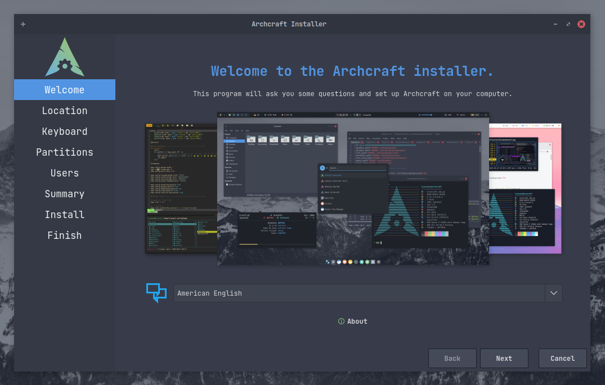
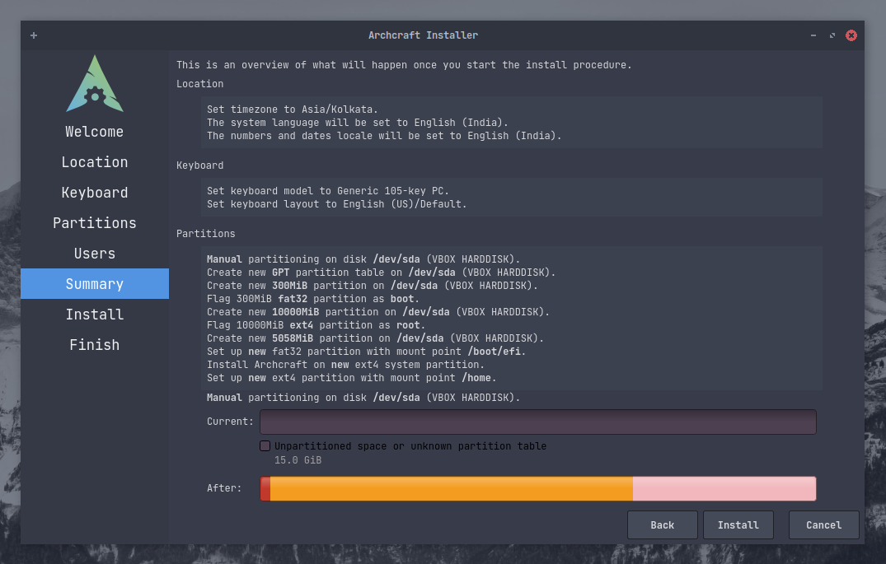

# Zainstaluj Archcrafta wykorzystując Calamares

Jest to prosty poradnik dla początkujących i niedoświadczonych użytkowników linuxa, jak zainstalować Archcrafta, nie robiąc przy tym bałaganu.
W tym poradniku będę instalował Archcrafta na systemie UEFI. Proces instalacji jest taki sam, dla systemów używających BIOSa.
Wykonaj poniższe kroki aby zainstalować Archcrafta.

Zakładam, że utworzyłeś już [bootowalne urządzenie USB](../boot-iso/boot-with-usb) z ISO Archcrafta. Uruchom Archcrafta używając bootowalnego USB, wybierz opcję **Boot Archcraft** *(Uruchom Archcrafta)*. Następnie uruchom instalator przez aplikację powitalną lub menu.

### Przygotowanie

Na ekranie powitalnym wybierz język instalatora i kliknij przycisk <kbd>Next</kbd> *(Dalej)*.

Wybierz **region**, **strefę czasową**, **lokalizację systemu** itp. i kliknij przycisk <kbd>Next</kbd> *(Dalej)* `Jeśli jesteś podłączony do Internetu, zostanie to dostosowane automatycznie`.

Wybierz swój **Układ klawiatury** i kliknij przycisk <kbd>Next</kbd> *(Dalej)* `Domyślnie układ klawiatury jest automatycznie dostosowywany do wybranych ustawień lokalnych systemu`.

### Partycjonowanie

:::note Informacja

**W tym pordaniku wszystkie operacje partycjonowania są wykonywane na pustym dysku.**

:::

Nadchodzi **straszna** część, w której prawie każdy początkujący użytkownik linuxa popełnia błędy.
Dlatego uważaj, co robisz w tym miejscu. Zaleca się, abyś przeczytał i zrozumiał [Schemat partycji](https://wiki.archlinux.org/title/Partitioning_(Polski)#Uk%C5%82ad_Partycji)
przed przystąpieniem do partycjonowania systemu.

Jeśli instalujesz Archcrafta w Virtualboxie (*w nowo utworzonej maszynie wirtualnej*), możesz po prostu wybrać opcje `Erase disk` *(Wyczyść/nadpisz dysk)*.
Jeśli jednak instalujesz go na prawdziwym PC, nie jest to najlepszy pomysł (*chyba, że chcesz całkowicie wyczyścić system*).
Na prawdziwym PC lepiej jest wybrać opcję `Manual Partitioning` *(Ręczne partycjonowanie)* i w tym poradniku wybierzemy właśnie tą opcję.
Wybierz opcje `Manual Partitioning` *(Ręczne partycjonowanie)* i kliknij przycisk <kbd>Next</kbd> *(Dalej)*.

W tym miejscu widać, że dysk jest całkowicie pusty (*ale w Twoim przypadku możesz zobaczyć tu kilka partycji*).
Najpierw stwórzmy **Partition table** *(Tablicę partycji)*. Dla UEFI użyj tablicy partycji `GPT`, a dla BIOS-u `MBR`.

> *Nie musisz tworzyć tablicy partycji, jeśli na dysku są już partycje, dotyczy to tylko pustych dysków.*

Została utworzona tablica partycji i możesz zobaczyć `Free Space` *(wolne miejsce)* na dysku. Teraz kliknij przycisk <kbd>Create</kbd> *(utwórz)*, aby utworzyć partycje. 

W tym pordaniku zostaną utworzone trzy partycje :
- `boot` : /boot/efi
- `root` : /
- `home` : /home

Dodatkowo możesz, (*a nawet powinieneś*) skonfigurować oddzielną partycję **swap**, ja ją jednak pomijam w tym poradniku.

W systemach **UEFI** do uruchomienia systemu potrzebna jest osobna partycja. Jeśli korzystasz z BIOS-u, możesz pominąć tworzenie osobnej partycji `boot`.

:::danger Niebezpieczeństwo

Twój system może posiadać już partycję **EFI**. W takim przypadku **`NIE FORMATUJ`** jej, ponieważ nie będziesz mógł uruchomić innego zainstalowanego już systemu operacyjnego (np. Windowsa) 
Po prostu zamontuj partycję EFI do `/boot/efi` 

:::

:::caution Uwaga

Upewnij się, że partycja EFI ma co najmniej `100 MB wolnego miejsca`, w przeciwnym razie instalacja się nie powiedzie. 

:::

Stwórzmy partycję EFI. Jak widać, stworzyłem partycję o rozmiarze `300MB` z systemem plików **fat32**
i zamontowałem ją do `/boot/efi` oraz ustawiłem flagę **boot**. 

Teraz utwórz partycję `root`. Ponownie wybierz opcję `Free Space` *(Wolne miejsce)* i kliknij <kbd>Create</kbd> *(Utwórz)*.
Wybierz rozmiar partycji głównej (*upewnij się, że ma co najmniej 10 GB*), system plików (*jeśli nie obchodzi Cię to, wybierz **ext4** fs*).
Zamontuj go do `/` i ustaw flagę na **root**. Opcjonalnie możesz również ustawić **label** *(etykietę)* dla systemu plików i jeśli chcesz używać **szyfrowania**, zaznacz pole `Encrypt` *(Szyfruj)* i ustaw hasło. 

I na koniec utwórz partycję `home` i zamontuj ją do `/home`.

Tak powinny wyglądać partycje. Gdy upewnisz się, że wszystko jest w porządku, kliknij przycisk <kbd>Next</kbd> *(Dalej)*.

### Zakończenie

Utwórz `user account` *(konto użytkownika)*,  wypełnij prosty formularz i kliknij przycisk <kbd>Next</kbd> *(Dalej)*.

Oto podsumowanie tej instalacji, niezależnie od wprowadzonych zmian i tego, co instalator zamierza teraz zrobić.
Przejrzyj to, a gdy upewnisz się, że wszystko jest dobrze, kliknij przycisk <kbd>Next</kbd> *(Dalej)*, aby rozpocząć **`Instalacje`** .

Teraz zaczyna się właściwa instalacja. Zajmie to kilka minut, w tym czasie możesz gapić się na postęp albo...
nie wiem, pójść na kawę czy coś.

Po zakończeniu zaznacz `Reboot now` *(Zrestartuj teraz)*, aby natychmiast zrestartować system.

**Dobra, to wszystko! Archcraft jest zainstalowany. Baw się dobrze!**

