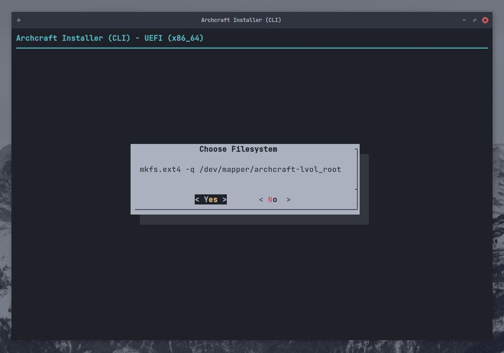
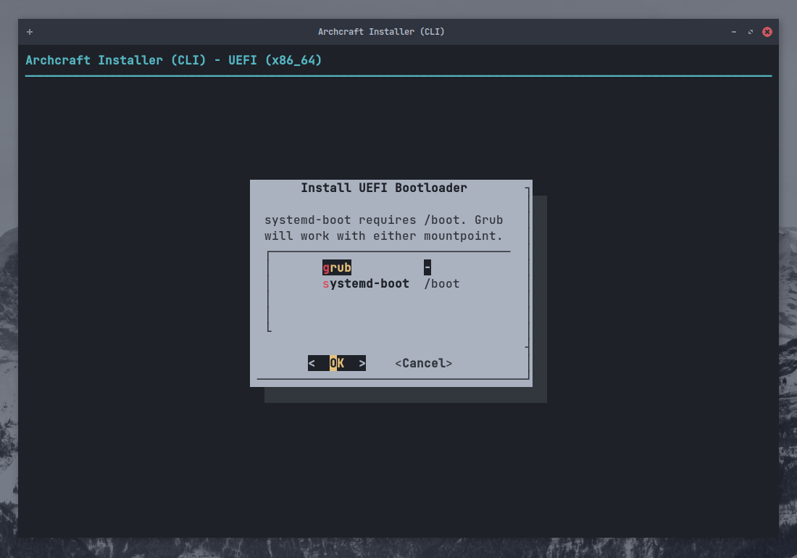
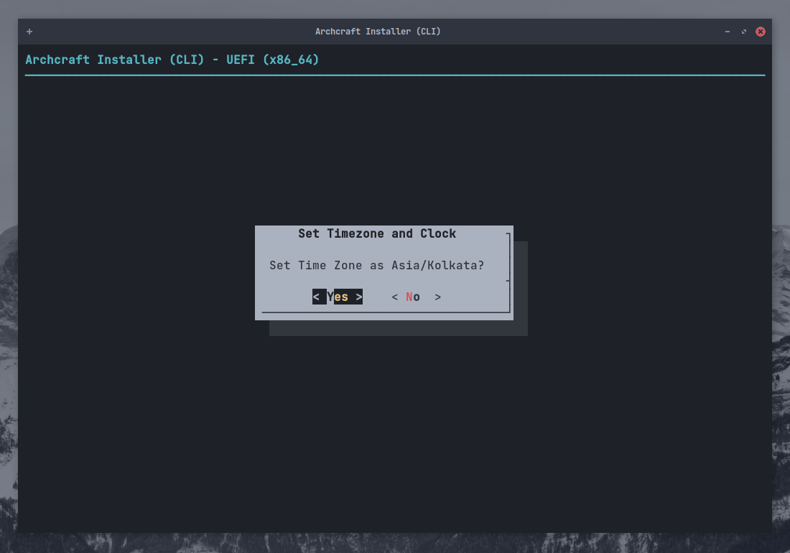

# Instalar o Archcraft com ABIF

**`ABIF`** é o instalador secundário no Archcraft, é baseado em linha de comando e é muito poderoso (*eu pessoalmente o uso*).
Espera-se que as pessoas que usarem este instalador para instalar o Archcraft saibam o que estão fazendo.

> *Eu não recomendo usar este instalador se você for iniciante, utilize o [Calamares](./install-with-calamares).* 
*Mas se você ainda quiser usar este instalador, você pode seguir este guia.*

Neste guia, instalarei o Archcraft em um sistema UEFI utilizando `Criptografia` e `LVM` usando **`ABIF`**. 
O processo será o mesmo se você estiver usando a BIOS.

Presumo que você já tenha criado um [USB bootavel](../boot-iso/boot-with-usb) com a ISO Archcraft, inicialize o sistema com ele e
selecione **Boot Archcraft**. Inicie o instalador por meio do aplicativo de boas-vindas ou do menu.

Selecione o idioma do instalador e pressione <kbd>Enter</kbd>

### Preparar a instalação

Selecione `Prepare Installation` e pressione <kbd>Enter</kbd>

Selecione `Set Virtual Console`, Escolha o seu layout e pressione <kbd>Enter</kbd>

Selecione `Set Desktop Keyboard Layout`, Escolha o seu layout e pressione <kbd>Enter</kbd>

### Partição do Disco

Selecione `List Devices` e pressione <kbd>Enter</kbd>

Aqui, você pode ver os discos e partições disponíveis em seu sistema.

Se o seu disco já estiver particionado, você pode pular isso e ir para :

- [Configurar LUKS](#configurar-criptografia-luks) (*Se quiser usar `Criptografia`*)
- [Configurar LVM](#configurar-lvm) (*Se desejar configurar `LVM`*)
- [Montar partições](#montar-partições) (*Se você deseja apenas uma instalação normal*)

Caso queira fazer o particionamento, selecione`Partition Disk` e pressione <kbd>Enter</kbd>

Selecione `Seu disco` e pressione <kbd>Enter</kbd>

Escolha qualquer utilitário de particionamento (* Usando `gparted` aqui*) e pressione <kbd>Enter</kbd>

Faça o particionamento e quando terminar, saia do `gparted`

:::caution Cuidado

Se o seu sistema já tiver uma partição EFI, certifique-se de ter pelo menos `100 MB de armazenamento livre`, ou a instalação falhará.
:::

### Configurar criptografia LUKS

Se você não quiser usar **Criptografia de disco**, você pode pular isso e ir para :

- [Configurar LVM](#configurar-lvm) (*Se desejar configurar `LVM`*)
- [Montar partições](#montar-partições) (*Se você deseja apenas uma instalação normal*)

Caso queira usar  **Criptografia de disco**, selecione `LUKS Encryption` e tecle <kbd>Enter</kbd>

Vou apenas usar `Automatic LUKS` mas se você tiver outra preferência, use-a e pressione <kbd>Enter</kbd>

Selecione a partição que deseja criptografar (*Vou criptografar o root, que é `/dev/sda2`*) e tecle <kbd>Enter</kbd>

Digite o nome para `Dispositivo de bloco criptografado` e pressione <kbd>Enter</kbd>

Digite uma `senha` forte e pressione <kbd>Enter</kbd>, repita o processo.

Você pode revisar sua configuração do LUKS aqui. Quando terminar, pressione <kbd>Enter</kbd> para sair

Repita o processo para criptografar outras partições (*por exemplo: `/home`*).
Quando terminar, selecione`Back` e pressione <kbd>Enter</kbd>

### Configurar LVM

Se você não quiser configurar **Volumes Lógicos**, pode pular isso e ir para [Montar Partições](#montar-partições). 
Caso queira, selecione `Logical Volume Management` e pressione <kbd>Enter</kbd>

Crie um **Grupo de Volume** primeiro, selecione `Create VG and LV(s)` e pressione <kbd>Enter</kbd>

Digite o nome do `grupo` e pressione <kbd>Enter</kbd>

Selecione as `Partições` (*use <kbd>barra de espaço</kbd>*) que deseja adicionar ao grupo LV e pressione <kbd>Enter</kbd>

Pressione <kbd>Enter</kbd> para confirmar a criação do grupo.

Você receberá uma caixa de diálogo, confirmando que o grupo foi criado. pressione <kbd>Enter</kbd> para sair.

Selecione o `Número` de volumes no grupo (*Escolhemos duas partições para adicionar no grupo criado anteriormente*) e pressione <kbd>Enter</kbd>

Digite o nome do primeiro LV (*para `root`*) e pressione <kbd>Enter</kbd>

Digite o tamanho do `LV` e pressione <kbd>Enter</kbd>

Você verá que o LV foi criado. pressione <kbd>Enter</kbd> para sair.

Faça o mesmo para o segundo LV, digite o nome e pressione <kbd>Enter</kbd>. O tamanho será selecionado automaticamente.

Pressione <kbd>Enter</kbd> para visualizar seu esquema LVM.

Quando terminar, pressione <kbd>Enter</kbd> para sair.

### Montar partições

Agora que configuramos as partições, (*Criptografia e LVM*). É hora de montá-los para instalação.

Selecione `Mount Partitions` e pressione <kbd>Enter</kbd>

Selecione a `Partição Raiz` e pressione <kbd>Enter</kbd>. Tenha em mente que :

- Se você configurar **LVM** (*com criptografia*), escolha-a para `root` (*por exemplo: nesta configuração **/dev/mapper/archcraft-lvol_root** será o root*)
- Se você configurar apenas **Criptografia** (*sem LVM*), escolha-a para `root` (*/dev/mapper/cryptroot*)
- Se você não configurou **Criptografia** ou *LVM*, escolha a partição `root` normalmente (*/dev/sda2*)

Selecione `ext4` como sistema de arquivos (*você pode escolher qualquer outro tipo de sistema de arquivos*) e pressione <kbd>Enter</kbd>

Selecione `Yes` e pressione <kbd>Enter</kbd> para formatar a partição, Ignore as outras coisas.

Se você configurou uma **Partição Swap**, você pode montá-la aqui. Você também pode usar um `Swapfile` se quiser.
Selecione o que preferir e pressione <kbd>Enter</kbd>

Agora, monte a partição `boot`. Selecione sua `partição EFI` (*/dev/sda1*) e pressione <kbd>Enter</kbd>

:::danger Perigo

Seu sistema pode já ter uma partição **EFI**. Nesse caso **`NÃO FORMATE`** ou você não conseguirá inicializar em outro Sistema Operacional instalado (digamos, Windows) 
Basta montar a partição EFI em `/boot`

:::

Selecione `No` se não quiser formatar a partição EFI e pressione <kbd>Enter</kbd>

Selecione `/boot` como ponto de montagem e pressione <kbd>Enter</kbd>

Agora você pode montar o resto das partições (*por ex: /home*) aqui. Selecione-a e pressione <kbd>Enter</kbd>

Novamente, selecione `ext4` (*ou qualquer outro*) como sistema de arquivo e pressione <kbd>Enter</kbd>

Digite o `ponto de montagem` para a partição e pressione <kbd>Enter</kbd>

Quando terminar de montar todas as partições, selecione `Done` e pressione <kbd>Enter</kbd> para sair

Selecione `Back` e pressione <kbd>Enter</kbd> para ir para a Instalação.

### Instalar Base

Agora que todas as partições estão montadas e prontas, vamos instalar os **`pacotes base`**

Selecione `Install Base` e ​​pressione <kbd>Enter</kbd>

Selecione `Install Base Packages` e pressione <kbd>Enter</kbd>

Aguarde a conclusão da instalação. Enquanto isso, [melhore seu humor...](https://youtu.be/dQw4w9WgXcQ?t=5)

Após a conclusão da instalação, selecione `Run Mkinitcpio` e pressione <kbd>Enter</kbd>

Isso ira gerar **initramfs-linux** e **initramfs-linux-fallback**.

Selecione `Install Bootloader` e pressione <kbd>Enter</kbd>

Selecione `grub` como bootloader e pressione <kbd>Enter</kbd>

Selecione `Yes` para tornar *grub* o gerenciador de inicialização padrão e pressione <kbd>Enter</kbd>

Selecione `Back` e pressione <kbd>Enter</kbd> para sair da instalação.

### Configurar base

Archcraft está instalado em seu sistema. É hora de configurar sua instalação.

Selecione `Configure base` e ​​pressione <kbd>Enter</kbd>

Selecione `Generate FSTAB` e pressione <kbd>Enter</kbd>

Selecione `Part UUID` para **UEFI** e `Device UUID` para **BIOS** e pressione <kbd>Enter</kbd>

Selecione `Set Hostname` e pressione <kbd>Enter</kbd>

Digite o `hostname` para o seu sistema e pressione <kbd>Enter</kbd>

Selecione `Set System Locale` e pressione <kbd>Enter</kbd>

Selecione a localidade que deseja usar (*`en_US.UTF-8` para inglês dos EUA*) e pressione <kbd>Enter</kbd>
<!---
  Analyze the possibility of changing the image below and use an example with Brazilian Portuguese
-->

Selecione `Set Timezone and Clock` e pressione <kbd>Enter</kbd>

Selecione seu `Fuso horário` (por exemplo: *`ASIA`*) e pressione <kbd>Enter</kbd>

Selecione sua `Região` (por exemplo: *`Kolkata`*) e pressione <kbd>Enter</kbd>

Selecione `Yes` e pressione <kbd>Enter</kbd>

Selecione `utc` e pressione <kbd>Enter</kbd>

:::info informação

Para dualboot com o Windows, é recomendável [configurar o Windows para usar UTC](https://wiki.archlinux.org/title/System_time#UTC_in_Microsoft_Windows),
em vez do Linux para usar o horário local. (*Windows por padrão usa hora local*)

:::

Selecione `Set Root Password` para definir uma senha para **root** e pressione <kbd>Enter</kbd>

Selecione `Add New User(s)` para criar nova(s) conta(s) de usuário e pressione <kbd>Enter</kbd>

Digite `username` e pressione <kbd>Enter</kbd>

Digite a `senha` para sua conta de usuário e pressione <kbd>Enter</kbd>. Confirme a senha.

Selecione `Security and systemd Tweaks` para ajustar essas coisas (*Se você souber o que fazer*) e pressione <kbd>Enter</kbd>

Quando terminar, selecione`Back` e pressione <kbd>Enter</kbd> para sair.

### Revisar arquivos de configuração

Selecione `Review Configuration Files` e pressione <kbd>Enter</kbd>

Selecione o `arquivo` que deseja visualizar e pressione <kbd>Enter</kbd>. Quando terminar, selecione `Back` para sair.

### Finalizar

Tudo está concluído... Agora você pode **`Sair do instalador`** e reiniciar o sistema.

Selecione `Done` e pressione <kbd>Enter</kbd>

Selecione `Yes` e pressione <kbd>Enter</kbd> para sair.

Reinicialize em seu sistema recém-instalado.

**Bem, é isso! Archcraft está instalado em seu sistema. Divirta-se!**
