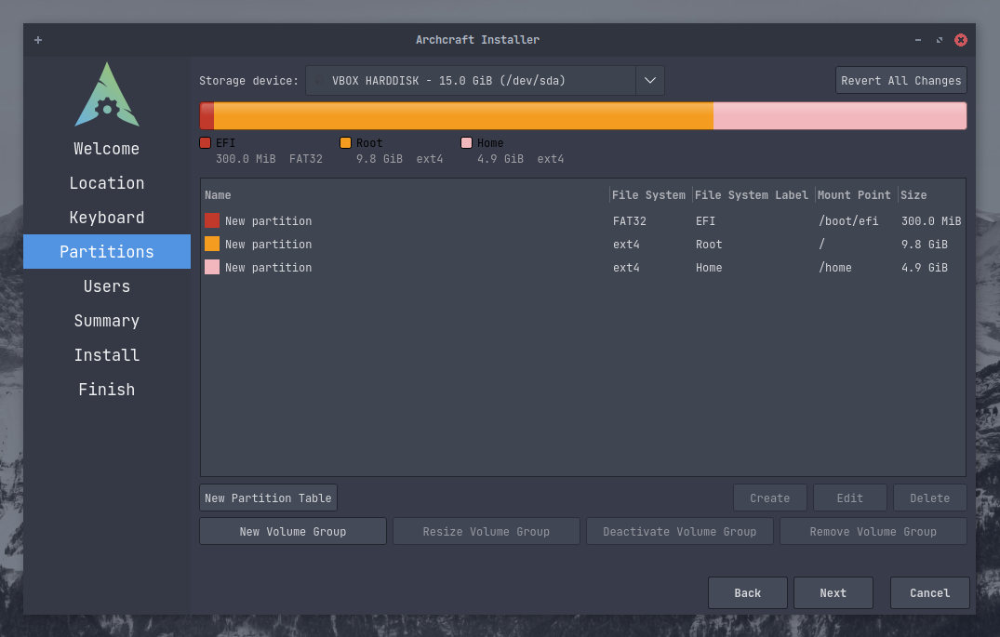

# Instalar Archcraft com Calamares

Este é um guia simples para iniciantes e novatos no Linux para instalar o Archcraft em seu sistema, sem bagunçar tudo.
Neste guia, instalarei o Archcraft em um sistema UEFI. Mas o processo é o mesmo se você estiver usando BIOS.
Siga os passos abaixo para instalar o Archcraft.

Estou assumindo que você já criou um [USB bootavel](../boot-iso/boot-with-usb) com a ISO do Archcraft,inicialize o sistema com ele e selecione **Boot Archcraft**. Inicie o instalador por meio do aplicativo de boas-vindas ou do menu.

### Preparação

Na tela de boas-vindas, selecione o idioma do instalador e clique em  <kbd>Next</kbd>

Selecione sua **Região**, **Fuso horário**, **Localidade do sistema** etc e clique em <kbd>Avançar</kbd> `Se você estiver conectado à internet, isso será ajustado automaticamente`

Selecione seu **Layout de teclado** e clique em <kbd>Avançar</kbd> `Por padrão, o layout do teclado é ajustado automaticamente de acordo com a localidade do sistema selecionado`

### Particionamento

:::note Nota

**Neste guia, todas as operações de particionamento são executadas em um disco vazio.**

:::

Aí vem a parte **assustadora**, onde quase todo novato em Linux bagunça tudo.
Então, cuidado com o que você faz aqui. É recomendado que você leia e entenda [Esquema de partição](https://wiki.archlinux.org/title/Partitioning#Partition_scheme)
antes de fazer qualquer particionamento em seu sistema.

Se você estiver instalando o Archcraft no Virtualbox (*em uma máquina virtual recém-criada*), basta selecionar `Apagar disco`
Mas em uma máquina real, isso não é uma boa ideia (*a menos que você decida limpar seu sistema completamente*)
Em um hardware real, é melhor você escolher `Particionamento manual` e neste guia faremos o mesmo.
Clique nesse botão com essa opção e clique em <kbd>Avançar</kbd>

Aqui, você pode ver que o disco está completamente vazio (*Mas, no seu caso, você pode ver várias partições aqui*).
Primeiro vamos criar uma **Tabela de partição**. Para UEFI, use a tabela de partições `GPT` e para BIOS, use `MBR`.

> *Você não precisa criar uma tabela de partição se o seu disco já tiver partições, é apenas para discos vazios*.

A tabela de partição é criada e você pode ver o 'Espaço Livre' em seu disco. Agora, clique no botão <kbd>Criar</kbd> para criar partições.

Para esta instalação, vamos criar três partições :
- `boot` : /boot/efi
- `root` : /
- `home` : /home

Além disso, você também pode (*deve*) configurar uma partição **swap** separada, estou pulando essa etapa aqui.

Em **sistemas UEFI**, é necessária uma partição separada para inicializar o sistema. Se você estiver no BIOS, pode pular a criação de uma partição `boot` separada.

:::danger Perigo

Seu sistema pode já ter uma partição **EFI**. Nesse caso **`NÃO FORMATE`** ou você não conseguirá inicializar em outro SO instalado (digamos, Windows) 
Basta montar a partição EFI em `/boot/efi`

:::

:::caution Cuidado

Certifique-se de que sua partição EFI tenha pelo menos `100 MB de armazenamento livre` ou a instalação falhará.

:::

Como no nosso caso o disco está vazio, vamos criar uma partição EFI. Como você pode ver, criei uma partição `300MB` com o sistema de arquivos **fat32**,
montei em `/boot/efi` e defini o sinalizador **boot**.

Agora crie uma partição `root`. Novamente, selecione `Free Space` e clique em <kbd>Criar</kbd>.
Selecione o tamanho da partição raiz (*certifique-se de que ela tenha pelo menos 10 GB*), sistema de arquivos (*se não se importar, escolha o sistema de arquivos **ext4** *).
Monte-a em `/` e defina o sinalizador como **root**, Opcionalmente, você também pode definir o **label** para o sistema de arquivos e, se quiser usar **Criptografia**, marque a caixa `Encrypt` e configure uma senha.

E, finalmente, crie uma partição `home` e monte-a em `/home`.

Veja como nossas partições ficaram para esta instalação. Quando tiver certeza de que está tudo bem, clique em <kbd>Avançar</kbd>

### Finalização

Crie uma `conta de usuário` para você, este é um formulário simples, preencha-o e clique em <kbd>Avançar</kbd>

Aqui está o resumo desta instalação, contendo quaisquer alterações que você tenha feito e o que o instalador fará agora.
Dê uma olhada nisso e quando estiver satisfeito, clique em <kbd>Avançar</kbd> para fazer a **`Instalação`**

Agora, a instalação propriamente dita começa. Levará alguns minutos, então, enquanto isso, você pode olhar os slides ou...
Não sei, vá tomar um café ou algo assim.

Quando terminar, marque a caixa `Reiniciar agora` para reiniciar o sistema instantaneamente.

**Bem, é isso! O Archcraft está instalado em seu sistema. Divertir-se!**
