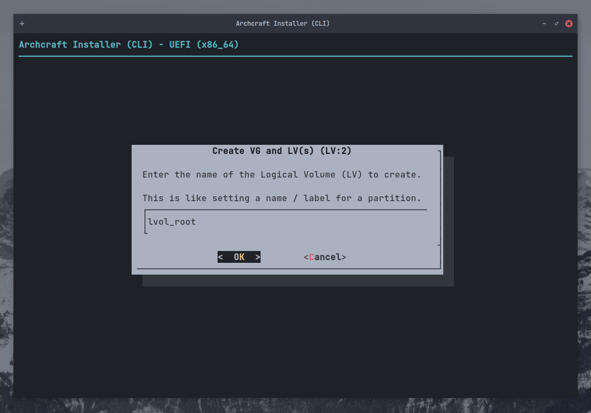
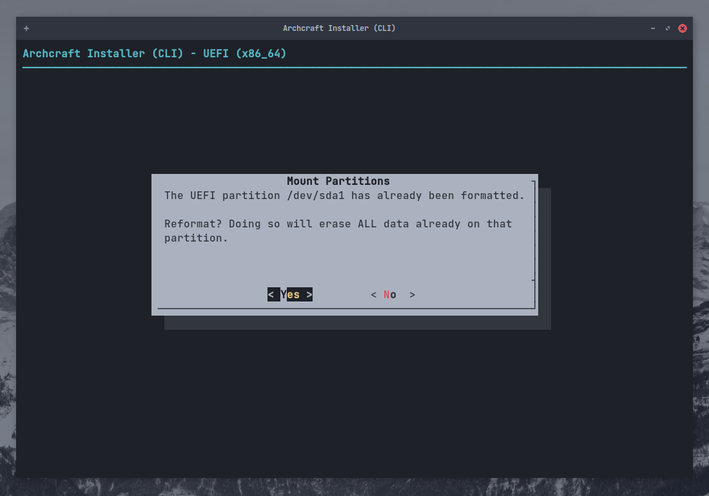
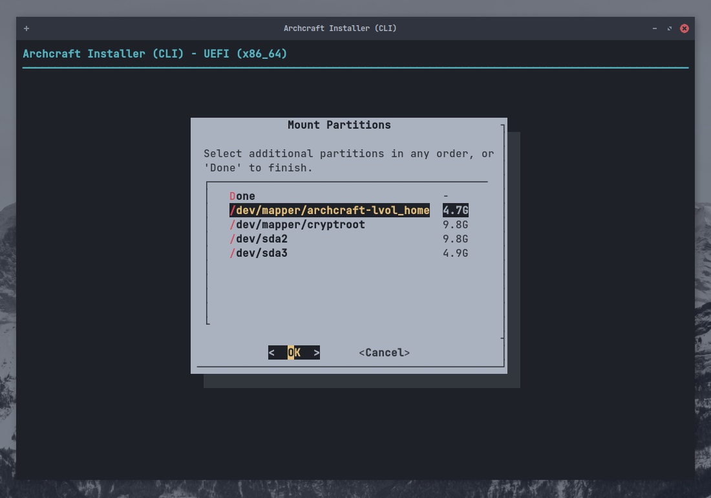
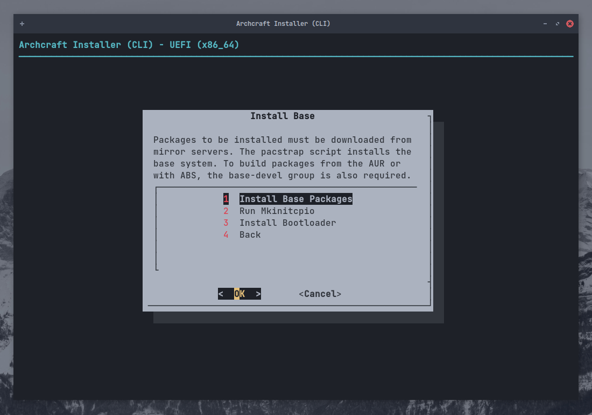
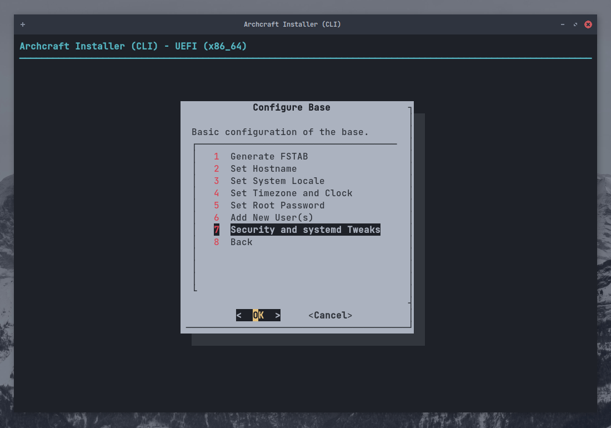

# Archcraft'ı ABIF ile Yükleyin

**ABIF**, Archcraft'taki ikincil yükleyicidir, komut satırında çalışır ve çok güçlüdür. (kişisel tercih olarak bunu kullanıyorum).

> *Yeni başlayan biriyseniz bu yükleyiciyi kullanmanız tavsiye edilmemektedir; bunun yerine [Calamares](./install-with-calamares) kullanın.* 
*Yine de bu yöntemle yükleme yapmak istiyorsanız bu rehberi takip edebilirsiniz.*

Bu kılavuzda, **`ABIF`** kullanarak `Encryption` ve `LVM` ile bir UEFI sistemine Archcraft kuracağız.
BIOS sistemlerde de bütün işlemler aynı olacaktır.

Archcraft ISO ile [önyüklenebilir bir USB](../boot-iso/boot-with-usb) oluşturduğunuzu varsayıyorum. Sisteminizi başlatın ve Boot Archcraft opsiyonunu seçin. 
Yükleyiciyi menüden ya da karşılama uygulamasından başlatabilirsiniz.

Kurulum dilini seçin ve <kbd>Enter</kbd>'a basın.

### Kuruluma Hazırlık

`Prepare Installation` opsiyonunu seçin ve <kbd>Enter</kbd>'a basın.

`Set Virtual Console` opsiyonunu seçin ve <kbd>Enter</kbd>'a basın.

`Set Desktop Keyboard Layout` opsiyonunu seçip, klavye ayarınızı yaptıktan sonra <kbd>Enter</kbd>'a basın.

### Disk Bölümlendirme

`List Devices` opsiyonunu seçin ve <kbd>Enter</kbd>'a basın.

Burada, sisteminizdeki kullanılabilir diskleri ve bölümleri görebilirsiniz.

Diskiniz halihazırda bölümlere ayrılmışsa bu adımı atlayabilir ve şunlara göz atabilirsiniz :

- [LUKS Yapılandırması](#setup-luks-encryption) (*`Encryption` kullanmak istiyorsaniz*)
- [LVM Yapılandırması](#setup-lvm) (*`LVM` yapılandırması yapmak istiyorsaniz*)
- [Bölümlerin Bağlanması](#mount-partitions) (*Normal kurulum yapmak istiyorsanız*)

Eğer disk bölümlendirmesi yapmak istiyorsanız `Partition Disk` opsiyonunu seçin ve <kbd>Enter</kbd>'a basın.

Mevcut diskinizi seçin ve <kbd>Enter</kbd>'a basın.

İstediğiniz disk bölümlendirme aracını seçin (*burada `gparted` kullanılmıştır*) ve <kbd>Enter</kbd>'a basın.

Bölümlendirme işlemini bitirdikten sonra `gparted` aracından çıkabilirsiniz.

:::caution Uyarı

Eğer sisteminizde halihazırda **EFI** bölümü varsa, bu bölümün `en az 100 MB boş depolama alanına` sahip olduğundan emin olun, aksi takdirde yükleme başarısız olur.

:::

### LUKS Encryption Yapılandırması

**Disk şifreleme** kullanmak istemiyorsanız aşağıdaki adımlara göz atabilirsiniz :

- [LVM Yapılandırması](#setup-lvm) (* `LVM` yapılandırması yapmak istiyorsanız*)
- [Bölümlerin Bağlanması](#mount-partitions) (* `LVM` kullanmak istemiyorsanız*)

**Disk şifreleme** kullanmak istiyorsaniz `LUKS Encryption` opsiyonunu seçin ve <kbd>Enter</kbd>'a basın.

Burada `Automatic LUKS` opsiyonunu kullanacağım ama başka tercihleriniz varsa seçiminizi yapın ve <kbd>Enter</kbd>'a basın.

Şifrelemek istediğiniz disk bölümünü seçin (*burada `dev/sda2` diskini şifreliyorum*) ve <kbd>Enter</kbd>'a basın.

`Şifrelenecek disk` için bir isim girin ve <kbd>Enter</kbd>'a basın.

Güçlü bir `şifre` oluşturun ve <kbd>Enter</kbd>'a basın. Aynı işlemi tekrarlayın.

LUKS yapılandırmanızı buradan inceleyebilirsiniz. Çıkmak için <kbd>Enter</kbd>'e basın

Diğer bölümleri şifrelemek için aynı işlemi tekrarlayın (*Örnek : `/home`*).
Tüm ayarlarınızı yaptıktan sonra `Back` opsiyonunu seçin ve <kbd>Enter</kbd>'a basın.

### LVM Yapılandırması

**Logical Volumes** yapılandırması yapmak istemiyorsanız bu adımı atlayabilir ve [Bölümlerin Bağlanması](#mount-partitions) sekmesine ilerleyebilirsiniz. 
Kuruluma devam etmek için `Logical Volume Management` opsiyonunu seçin ve <kbd>Enter</kbd>'a basın.

Öncelikle, bir **Volume Group** oluşturmak için `Create VG and LV(s)` opsiyonunu seçin ve <kbd>Enter</kbd>'a basın.

Oluşturulacak `grup` için bir isim girin ve <kbd>Enter</kbd>'a basın.

LV grubuna eklemek istediğiniz bölümleri seçin ( <kbd>BOŞLUK</kbd> tuşunu kullanın) ve <kbd>Enter</kbd>'a basın.

Grup oluşumunu onaylamak için <kbd>Enter</kbd>'a basın.

Grubun oluşturulduğunu onaylayan bir iletişim kutusu göreceksiniz. Çıkmak için <kbd>Enter</kbd>'a basın.

Gruptaki birimlerin sayısını seçin (*Daha önce gruba eklemek için iki bölüm seçiyoruz*) ve <kbd>Enter</kbd>'a basın.

Oluşturulacak ilk birim için bir isim girin (* `root` için*) ve <kbd>Enter</kbd>'a basın.

Oluşturulacak ilk birimin boyutunu girin ve <kbd>Enter</kbd>'a basın.

İlk birimin oluşturulduğunu onaylayan bir iletişim kutusu göreceksiniz. Çıkmak için <kbd>Enter</kbd>'a basın.

Oluşturulacak ikinci birim için bir isim girin ve <kbd>Enter</kbd>'a basın. Birimin boyutu otomatik olarak belirlencektir.

Oluşturulan birimlerin şemasını görmek için <kbd>Enter</kbd>'a basın.

Tüm ayarlardan emin olduktan sonra çıkmak için <kbd>Enter</kbd>'a basın.

### Bölümlerin Bağlanması

Bölümlerin kurulumunu yaptık. (*Encryption and LVM*) Şimdi sıra kurulum için oluşturduğumuz bölümlerin bağlanmasında.

`Mount Partitions` opsiyonunu seçin ve <kbd>Enter</kbd>'a basın.

`Root Partition` opsiyonunu seçin ve <kbd>Enter</kbd>'a basın. Aklınızda bulunsun :

- If you setup **LVM** (*with encryption*), choose that for `root` (*for ex : in this setup **/dev/mapper/archcraft-lvol_root** will be the root*)
- If you setup **Encryption** only (*no LVM*), choose that for `root` (*/dev/mapper/cryptroot*)
- If you've not setup *Encryption* or *LVM*, choose `root` normally (*/dev/sda2*)

Dosya sistemi için `ext4` opsiyonunu seçin (*istediğiniz başka bir dosya sistemini de seçebilirsiniz*) ve <kbd>Enter</kbd>'a basın.

Bölümü biçimlendirmek için `Yes` opsiyonunu seçip <kbd>Enter</kbd>'a basın. Diğer ayarları görmezden gelin.

Eğer **Swap Partition** yapılandırması yaptıysanız bölümün bağlantısını buradan yapabilirsiniz. İsterseniz bir Swapfile de kullanabilirsiniz.
Tercihlerinizi yaptıktan sonra <kbd>Enter</kbd>'a basın.

Şimdi sıra `boot` bölümünün bağlanmasında. `EFI partition` (*/dev/sda1*) opsiyonunu seçip <kbd>Enter</kbd>'a basın.

:::danger Dikkat

Sisteminizde halihazırda bir **EFI** bölümü olabilir. Bu durumda ***`DİSKİNİZİ BİÇİMLENDİRMEYİN`***, aksi takdirde sisteminizde yüklü olan diğer işletim sistemlerine önyükleme yapamazsınız (Örnek : Windows) 
**EFI** bölümünü `/boot` dizinine bağlamanız yeterlidir.

:::

EFI bölümünü biçimlendirmek istemiyorsaniz `No` opsiyonunu seçin ve <kbd>Enter</kbd>'a basın.

Bağlantı noktası olarak `/boot` opsiyonunu seçin ve <kbd>Enter</kbd>'a basın.

Şimdi, geri kalan bölümlerin de bağlantılarını yapabilirsiniz. (*Örnek: /home*) Seçiminizi yapın ve <kbd>Enter</kbd>'a basın.

Dosya sistemi olarak `ext4` opsiyonunu ya da istediğiniz bir tanesini seçiniz ve <kbd>Enter</kbd>'a basın.

Bölüm için bağlantı noktasını seçin ve <kbd>Enter</kbd>'a basın.

Tüm bölümlerin bağlantılarını yaptıktan sonra `Done` opsiyonunu seçin ve <kbd>Enter</kbd>'a basın.

Yükleme ekranına geri dönmek için `Back` opsiyonunu seçin ve <kbd>Enter</kbd>'a basın.

### Temel Paketlerin Kurulumu

Tüm bölümler bağlandığına göre `Temel Paketleri` yükleyebiliriz.

`Install Base` opsiyonunu seçin ve <kbd>Enter</kbd>'a basın.

`Install Base Packages` opsiyonunu seçin ve <kbd>Enter</kbd>'a basın.

Yüklemenin bıitmesini beklerken, [neşenizi arttıracak bir müzik iyi gider...](https://youtu.be/dQw4w9WgXcQ?t=5)

Yükleme tamamlandıktan sonra `Run Mkinitcpio` opsiyonunu seçin ve <kbd>Enter</kbd>'a basın.

Bu, **initramfs-linux** ve **initramfs-linux-fallback** girdilerini oluşturacaktır.

`Install Bootloader` opsiyonunu seçin ve <kbd>Enter</kbd>'a basın.

`grub` opsiyonunu seçin ve <kbd>Enter</kbd>'a basın.

*grub*'ı varyasayılan önyükleyici olarak seçmek için `Yes` opsiyonunu seçin ve <kbd>Enter</kbd>'a basın.

Kurulumdan çıkmak için `Back` opsiyonunu seçin ve <kbd>Enter</kbd>'a basın.

### Temel Paketlerin Yapılandırılması

Archcraft sisteminizde kuruldu. Kurulumunuzu yapılandırmanın zamanı geldi.

`Configure Base` opsiyonunu seçin ve <kbd>Enter</kbd>'a basın.

`Generate FSTAB` opsiyonunu seçin ve <kbd>Enter</kbd>'a basın.

**UEFI** için `Part UUID`, **BIOS** için `Device UUID` opsiyonunu seçin ve <kbd>Enter</kbd>'a basın.

`Set Hostname` opsiyonunu seçin ve <kbd>Enter</kbd>'a basın.

Sisteminiz için bir `hostname` girin ve <kbd>Enter</kbd>'a basın.

`Set System Locale` opsiyonunu seçin ve <kbd>Enter</kbd>'a basın.

Sisteminiz için yerel ayarları yapınız (*Amerikan İngilizcesi için `en_US.UTF-8`*) ve <kbd>Enter</kbd>'a basın.

`Set Timezone and Clock` opsiyonunu seçin ve <kbd>Enter</kbd>'a basın.

`Time Zone` seçiminizi yapın (Örnek : *`ASIA`*) ve <kbd>Enter</kbd>'a basın.

`Region` seçiminizi yapın (Örnek : *`Kolkata`*) ve <kbd>Enter</kbd>'a basın.

`Yes` opsiyonunu seçin ve <kbd>Enter</kbd>'a basın.

`utc` opsiyonunu seçin ve <kbd>Enter</kbd>'a basın.

:::info Bilgilendirme

Windows ile birlikte çift işletim sistemi kullanmak istiyorsanız, [Windows'un yerel saat ayarlarını yapmanız tavsiye edilir.](https://wiki.archlinux.org/title/System_time#UTC_in_Microsoft_Windows)
(*Windows varsayılan olarak yerel zamanı kulanır.*)

:::

**root** kullanıcısına parola oluşturmak için `Set Root Password` opsiyonunu seçin ve <kbd>Enter</kbd>'a basın.

Yeni kullanıcı/lar oluşturmak için `Add New User(s)` opsiyonunu seçin ve <kbd>Enter</kbd>'a basın.

`Kullanıcı adınızı` girin ve <kbd>Enter</kbd>'a basın.

Kullanıcı için `parolanızı` girin ve onaylamak için <kbd>Enter</kbd>'a basın.

Güvenlik ayarlarını ve sistem detaylarını ayarlamak istiyorsanız (*eğer ne yaptığınızı biliyorsanız*) `Security and systemd Tweaks` opsiyonunu seçin ve <kbd>Enter</kbd>'a basın.

Tüm ayarlamalar bittiğinde `Back` opsiyonunu seçin ve <kbd>Enter</kbd>'a basın.

### Yapılandırma Dosyalarının İncelenmesi

`Review Configuration Files` opsiyonunu seçin ve <kbd>Enter</kbd>'a basın.

İncelemek istediğiniz `dosyayı` seçin ve <kbd>Enter</kbd>'a basın. İncelemenizi sonlandırmak için `Back` opsiyonunu seçin.

### Sonuç

Her şey tamamlandı... **`Quit the installer`** opsiyonunu ile yükleyiciden çıkıp sistemi yeniden başlatabilirsiniz.

`Done` opsiyonunu seçin ve <kbd>Enter</kbd>'a basın.

Çıkmak için `Yes` opsiyonunu seçin ve <kbd>Enter</kbd>'a basın.

Yeni kurulan sisteminizi yeniden başlatın.

**İşte bu kadar! Kurulumu tamamladınız. Archcraft'ın tadını çıkarın!**
