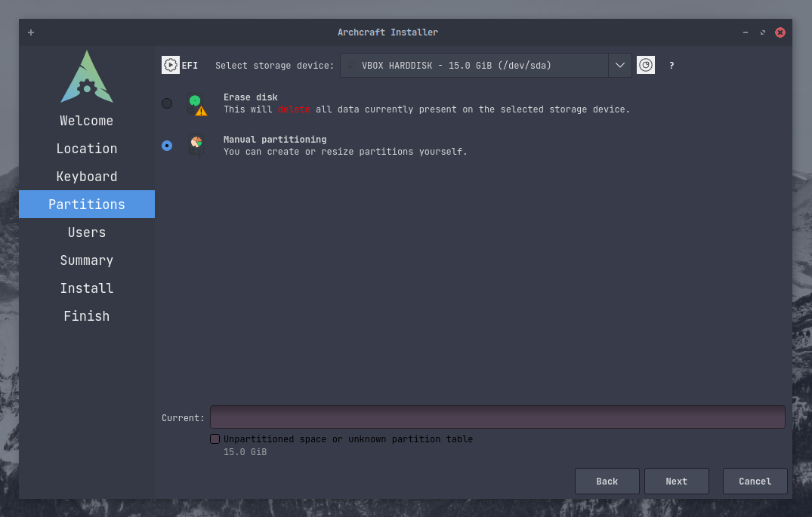

# Archcraft'i Calameres ile Yükleme

Bu rehber, Linux'a yeni başlayanlar için Archcraft'ı sistemlerine rahatça kurabilmeleri oluşturulmuştur.
Bu rehberde Archcraft bir UEFI sistemine yüklenecektir ama tüm süreç BIOS sistemler için de aynıdır.
Archcraft'ı sisteminize yüklemek için aşağıdaki adımları takip ediniz.

Archcraft ISO ile [önyüklenebilir bir USB](../boot-iso/boot-with-usb) oluşturduğunuzu varsayıyorum. 
Sisteminizi başlatınız ve **Boot Archcraft** opsiyonunu seçin. Yükleyiciyi menüden ya da karşılama uygulamasından başlatabilirsiniz.

### Hazırlık

Karşılama ekranından tercih ettiğiniz dili seçin ve <kbd>Next</kbd> butonuna tıklayın.

**Bölge**, **saat dilimi** ve **sistem dilini** seçtikten sonra <kbd>Next</kbd> butonuna basın. 
`İnternete bağlıysanız, bu ayarlar otomatik olarak yapılacaktır.`

**Klavye düzenini** seçtikten sonra <kbd>Next</kbd> butonuna basın. 
`Varsayılan klavye düzeni, seçilen sistem diline göre otomatik olarak ayarlanır.`

### Disk Bölümlendirme

:::note Not

**Bu kılavuzda, tüm bölümlendirme işlemleri boş bir disk üzerinde gerçekleştirilir.**

:::

Şimdi sıra Linux acemileri için en korkutucu bölümde. Bundan sonrası için ne yaptığınıza dikkat etmeniz önerilir. Disk bölümlendirme yapmadan önce 
[Partition scheme](https://wiki.archlinux.org/title/Partitioning#Partition_scheme) dokümantasyonunu okuduğunuzdan emin olun.

Eğer Archcraft'ı VirtualBox üzerinde yüklüyorsanız (*yeni oluşturulan bir sanal makinede*), `Erase disk` seçeneğini seçebilirsiniz.
Fakat gerçek bir bilgisayara yükleme yapıyorsanız, bu çok iyi bir fikir olmayabilir. (*tabii ki sisteminizi tamamen silmeye karar vermediyseniz*)
Gerçek bir donanımda, `Manuel Partitioning` opsiyonunu seçmeniz daha iyi olacaktır ve bu kılavuzda biz de aynısını yapacağız.
Seçiminizi yaptıktan <kbd>Next</kbd> butonuna basın.

Burada görebileceğiniz üzere örnekteki disk tamamen boş durumda. (*Fakat sizin durumunuzda burada birden fazla bölüm olabilir.*).
Öncelikle **Partition table** (**Disk Bölüm Tablosu**) oluşturmalısınız. UEFI sistemler için `GPT` opsiyonunu, BIOS sistemler için `MBR` opsiyonunu kullanabilirsiniz.

> *Eğer diskinizde halihazırda oluşturulmuş bölümler varsa, **Partition table** (**Disk Bölüm Tablosu**) oluşturmanız gerekmemektedir. Buradaki işlemler sadece boş diskler için geçerlidir.*.

**Partition table** (**Disk Bölüm Tablosu**) oluşturulduğunda diskinizdeki `Boş Alanı` (**Free Space**) görebilirsiniz. Şimdi, <kbd>Create</kbd> butonuna basıp, bölümlerinizi yaratabilirsiniz.

Bu kurulum için üç bölüm oluşturacağız :
- `boot` : /boot/efi
- `root` : /
- `home` : /home

Bunlara ek olarak, **swap** bölümü oluşturabilirsiniz (*oluşturmalısınız*), biz burada bunu yapmayacağız.

**UEFI** sistemlerinde, sistemi başlatmak için ayrı bir bölüm gerekir. Ancak **BIOS** bir sistem kullanıyorsanız, ayrı bir `boot` bölümü oluşturmayı atlayabilirsiniz.

:::danger Dikkat

Sisteminizde halihazırda bir **EFI** bölümü olabilir. Bu durumda ***`DİSKİNİZİ BİÇİMLENDİRMEYİN`***, aksi takdirde sisteminizde yüklü olan diğer işletim sistemlerine önyükleme yapamazsınız (Örnek : Windows) 
**EFI** bölümünü `/boot/efi` dizinine bağlamanız yeterlidir.

:::

:::caution Uyarı

**EFI** bölümünüzün `en az 100 MB boş depolama alanına` sahip olduğundan emin olunuz, aksi takdirde yükleme başarısız olur.

:::

Bizim durumumuzda disk boş olduğundan bir EFI bölümü yaratalım. Gördüğünüz gibi, **fat32** dosya sistemiyle 300MB'lık bir bölüm oluşturdum ve onu `'/boot/efi` dizinine bağladım ve etiket olarak **boot** kutusunu işaretledim.

Şimdi `root` bölümünü oluşturun. Yeniden `Boş Alan` (**Free Space**) opsiyonunu seçin ve <kbd>Create</kbd> butonuna tıklayın.
`root` bölümünüzün boyutunu belirtiniz (*en az 10 GB boyutunda olduğundan emin olun*) ve dosya sistemi opsiyonundan uygun olanını seçin. (*Emin değilseniz **ext4** opsiyonu ile devam edebilirsiniz*)
Bağlantı noktası olarak `/` seçeneğini, etiket olarak da **root** seçeneğini seçebilirsiniz. Şifreleme kullanmak istiyorsanız, `Encrypt` kutusunu işaretley ve bir şifre belirleyin.

Son olarak `home` bölümünü oluşturun ve bağlantı noktası olarak `/home` opsiyonunu seçin.

Bu kurulum için oluşturduğumuz bölümler bu şekilde. Tüm ayarlardan eminseniz, <kbd>Next</kbd> butonuna tıklayın.

### Son Olarak

Formu doldurarak kendiniz için bir `kullanıcı` oluşturun ve <kbd>Next</kbd> butonuna tıklayın.

Bu ekranda yüklemenin şu noktasına kadar yaptığınız tüm ayarların özetini görebilirsiniz. Eğer bütün ayarlardan eminseniz <kbd>Install</kbd> butonuna basıp yüklemeyi başlatınız.

Şimdi, asıl kurulum başlıyor. Kurulum birkaç dakika sürebilir. Sizde bu sırada slaytlara göz atıp bilgi edinebilirsiniz.

Belki de çay veya kahve molası vermek istersiniz.

Yükleme tamamlandığında, sistemi yeniden başlatmak için `Restart now` kutusunu işaretleyin.

**İşte bu kadar! Kurulumu tamamladınız. Archcraft'ın tadını çıkarın!**
