# 使用Calamares安装Archcraft

这是一个为初学者和Linux新手打造的简易指南，帮助其安装Archcraft到设备上且不搞得一团糟，

我假定你已经使用Archcraft ISO文件创建了一个[可引导USB设备](../boot-iso/boot-with-usb)，用其引导进入系统并选择了**Boot Archcraft**，并从菜单或者欢迎软件中打开了安装器。

:::info

来自中文文档翻译者：为了方便理解，文章中的设置项名词都被替换为了中文，但是配图仍为原版配图，请在安装过程中自行设置语言。

:::

### 准备

在欢迎界面，选择安装器使用的语言并点击<kbd>下一步</kbd>

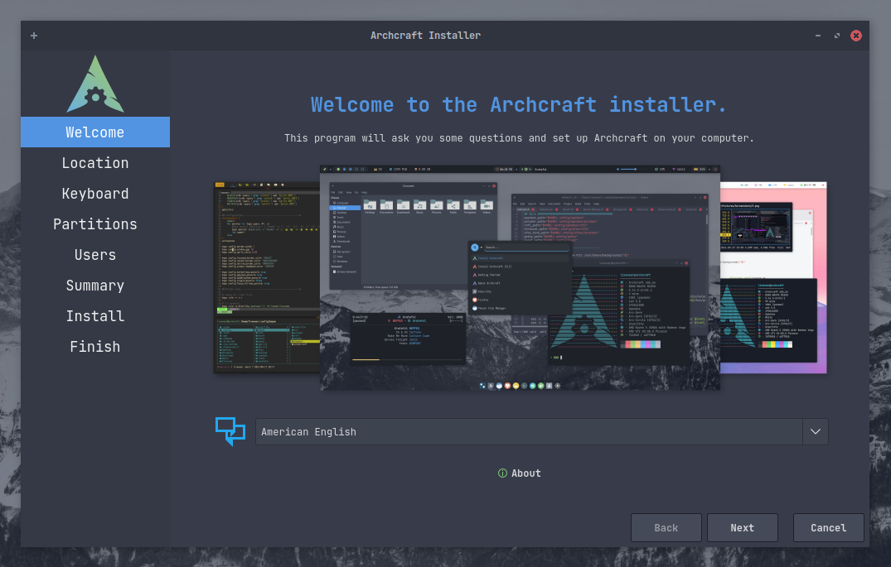

选择你的 **地区**, **时区**, **系统区域** 并点击 <kbd>下一步</kbd> 。`如果你连接到了网络，这些项目将会自动调整`

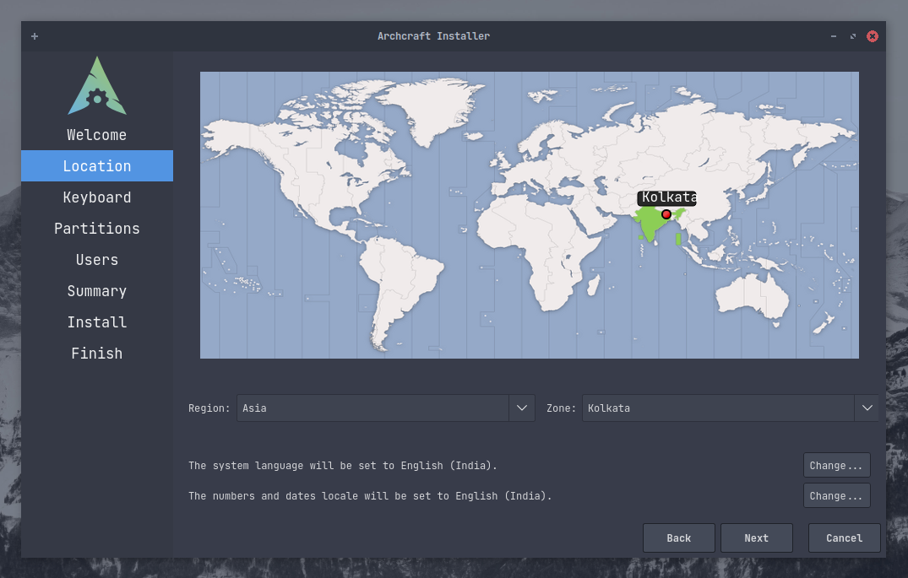

选择你的 **键盘布局** 并且点击 <kbd>下一步</kbd> 。`默认情况下，键盘布局将会随着系统区域设置自动调整`

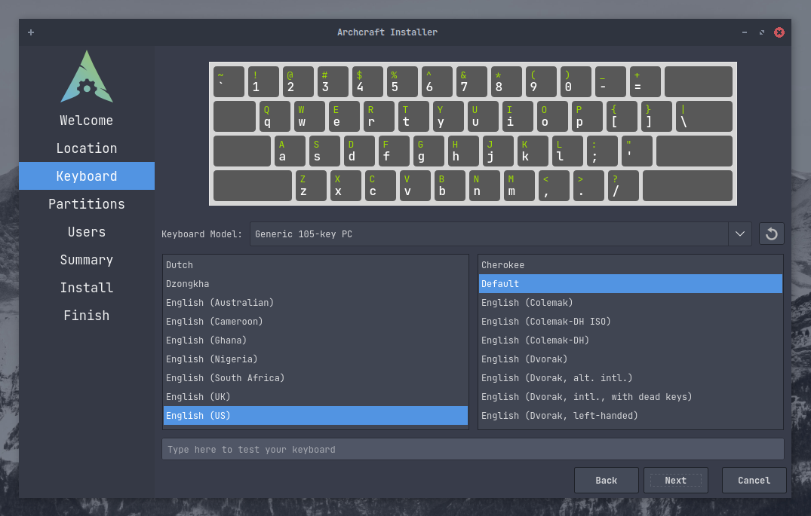

### 分区

:::note

**在本指南中，所有分区操作都是在空硬盘上进行的。**

:::

这就是几乎每个Linux初学者都会搞砸的**可怕**部分。所以，当心你的操作。在执行任何分区操作之前，建议你阅读并理解[Partition scheme](https://wiki.archlinux.org/title/Partitioning#Partition_scheme)。

如果你正在Virtualbox（一个新创建的虚拟机）上安装Archcraft，你可以直接选择 `擦除硬盘`。但是在实体机上，这不是一个好主意(*除非你决定完全擦除你的系统*)。在真实的硬件上，你最好选择 `手动分区`——在本指南中，我们也会这样做。选择你要使用的方式并点击<kbd>下一步</kbd>。

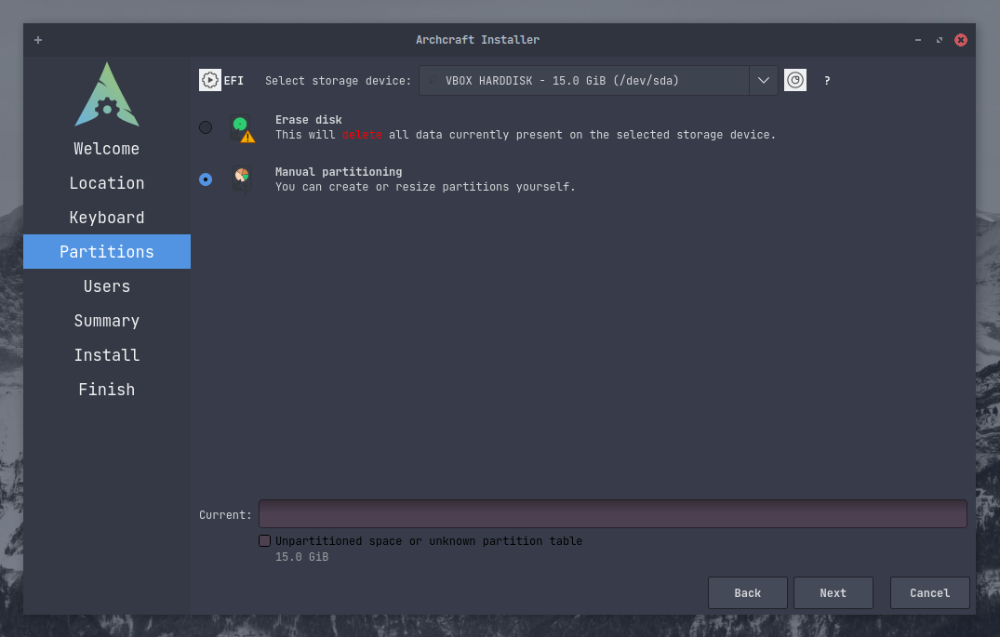

在这里你会看到这个硬盘完全是空的(*但是在实际情况下可能会存在很多分区*)。让我们首先来创建 **分区表**。对于UEFI引导，选择`GPT`分区表；对于BIOS引导，选择`MBR`分区表。

> *如果你的硬盘中已经存在了分区则不需要创建分区表，只有空白的硬盘需要进行此步骤。*.

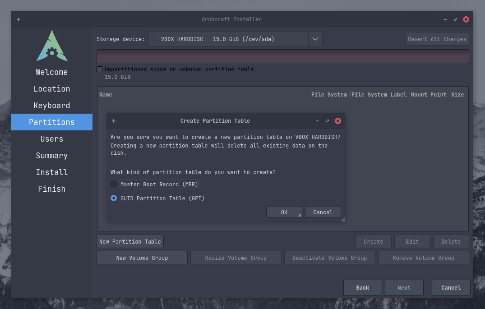

分区表创建之后你可以看到在你硬盘上的`剩余空间`。现在，点击<kbd>创建</kbd>按钮来创建分区表。

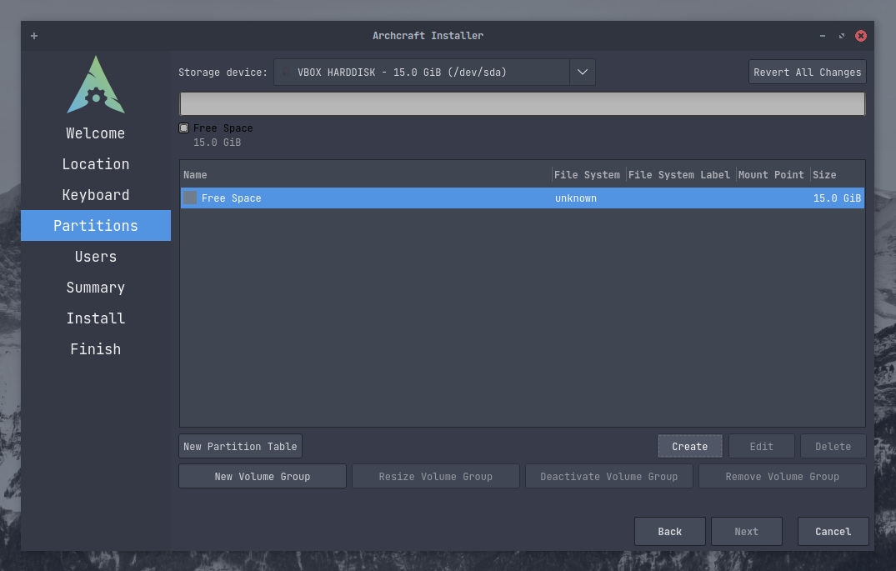

为了安装系统，我们将要创建以下三个分区：
- `boot` : /boot/efi
- `root` : /
- `home` : /home

此外，你也可以（*也应该*）创建一个独立的**swap**分区，这里先跳过。

:::info

来自中文文档翻译者：swap分区，即交换分区，可以起到虚拟内存的作用。是否分配可以根据本机内存是否够用决定。一般4g以下建议设置为内存的2倍，4g~16g建议设置为与内存大小等同，大于16g的建议设置为16g。

:::

在**UEFI**系统中，需要设立一个独立的分区（即/boot）来引导系统。如果你使用的是BIOS则可以跳过创建此分区。

:::danger

你的系统可能已经存在了一个**EFI**分区。如果是这样的话**`千万不要`**格式化它，否则你将不能引导进入其他系统。 
只要把EFI分区挂载到`/boot/efi`即可。

:::

:::caution

确保你的EFI分区`至少拥有100MB的剩余内存`，否则可能会安装失败。

:::

像我这样的情况，硬盘是空白的，所以需要创建一个EFI分区。正如你所见，我创建了一个300MB的，使用fat32文件系统的分区。并将其挂载到`/boot/efi`，设置表示为**boot**。

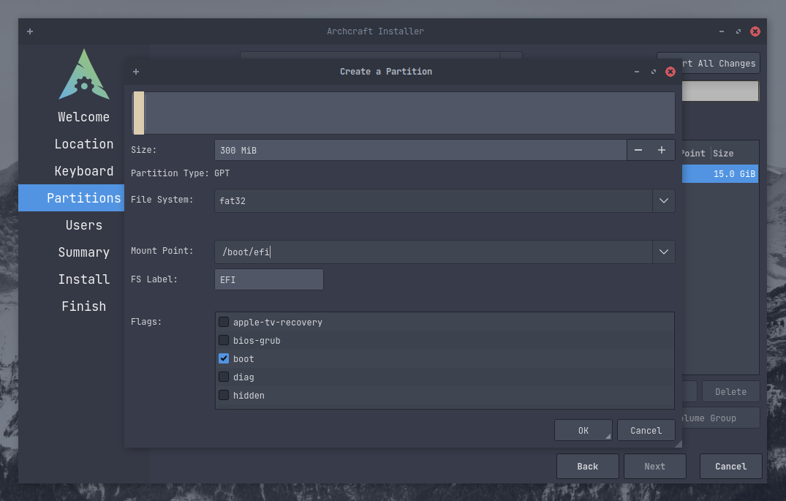

现在重复操作创建一个root分区：选择`剩余空间`并且点击<kbd>创建</kbd>。选择root分区的大小(*确保至少10GB*)和文件系统(*如果你不关心的话，选择**ext4**文件系统*)。将分区挂载到`/`并且设置标识为**root**。同时你也可以选择为分区命名标签和是否加密。

:::info

来自中文文档翻译者：linux支持多种文件系统，其中ext4最为通用。如果你想要获得其他的特性支持，比如快照功能、纠错等，可以考虑使用其他文件系统。

:::

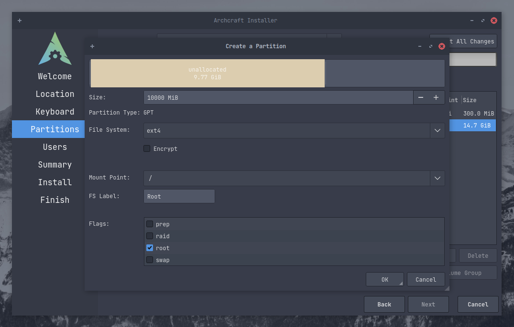

最后，创建一个`home`分区并将其挂载到`/home`。

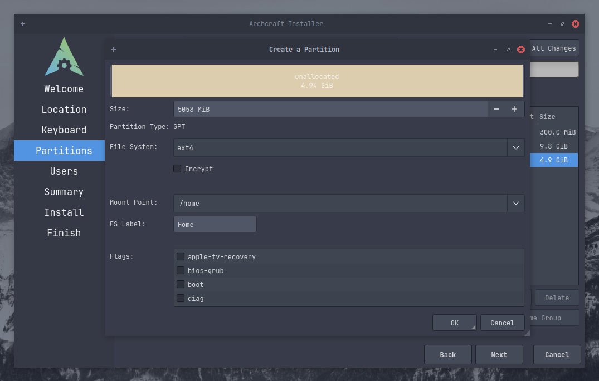

以下就是我们用于安装的分区结构。如果你确定没有问题的话，点击<kbd>下一步</kbd>。

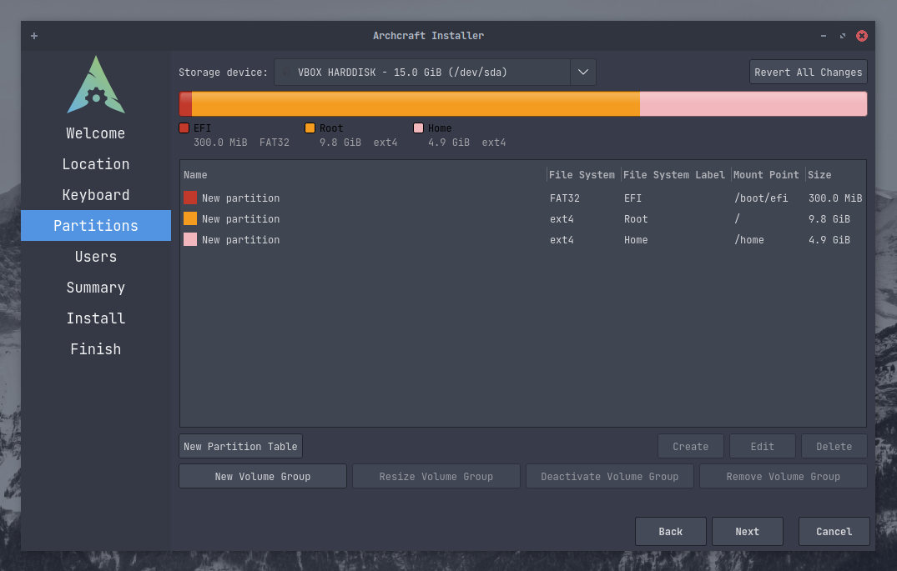

### 最终

为自己创建一个`用户账户`，这是一个简单的表格，填写好后点击<kbd>下一步</kbd>。

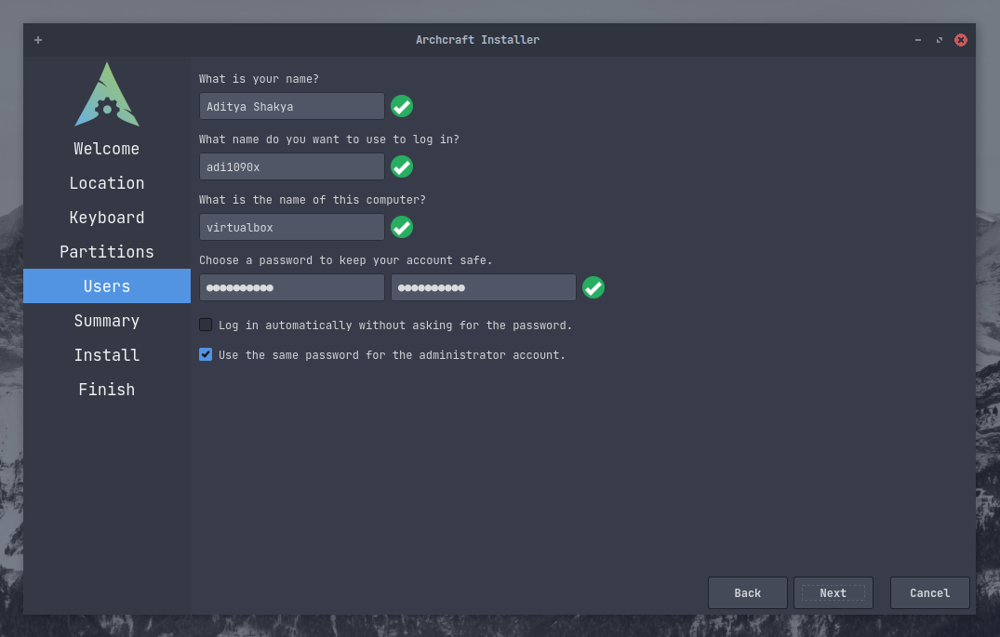

以下就是本次安装的摘要信息，也就是你刚刚做出的修改和安装器将要进行的操作。
检查一下，如果你认为没有问题的话，点击<kbd>下一步</kbd>来开始**`安装`**。

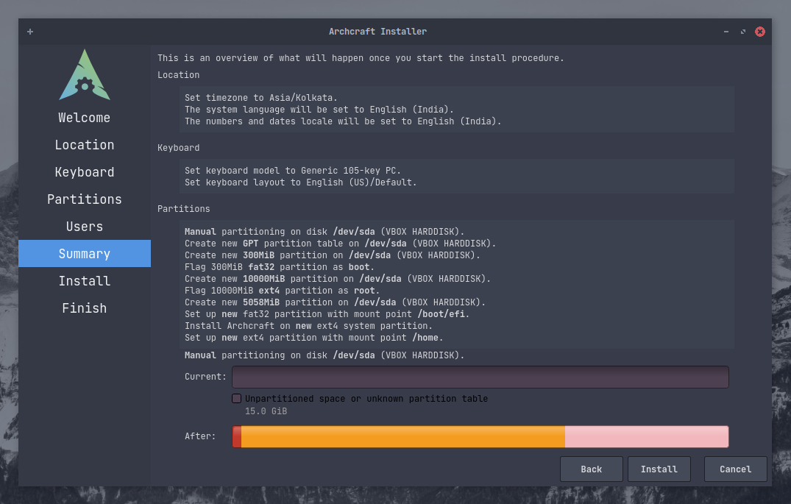

现在，实际上的安装开始了，这可能会花上几分钟。所以，与此同时你可以盯着进度条或者...我也不知道，去喝点咖啡或者吃点什么吧。

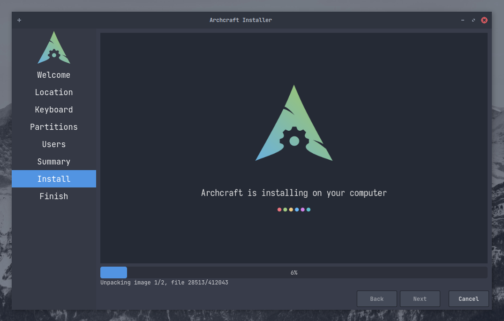

当安装完成后，勾选`现在重启`的多选框并点击<kbd>完成</kbd>来立刻重启系统。

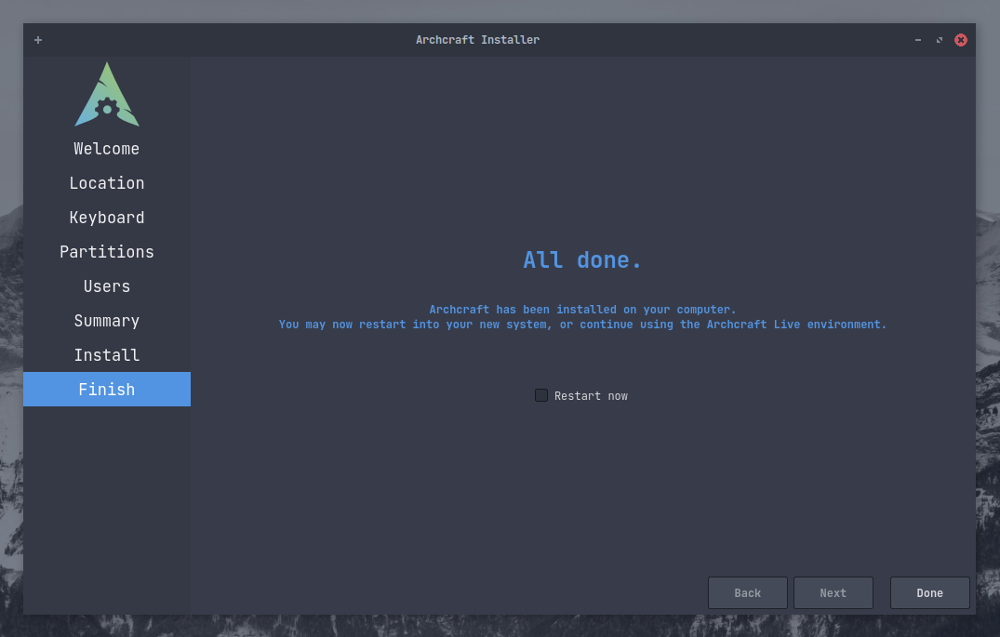

**Archcraft已经安装到你的设备上了，享受它吧！**
