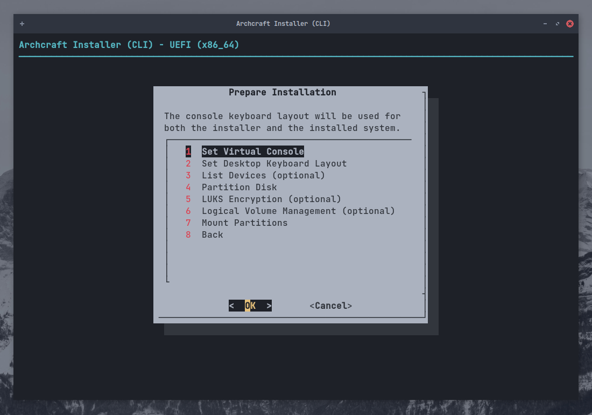
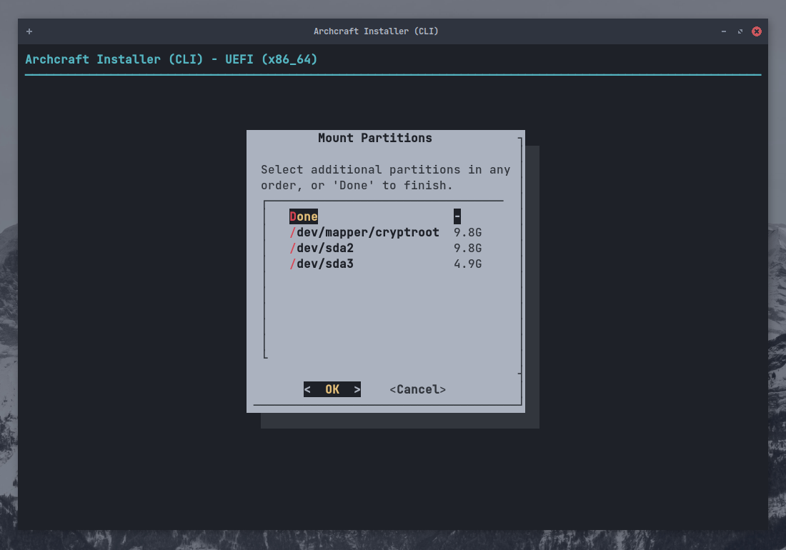

# 使用 ABIF 安装 Archcraft

使用 **`ABIF`** 是另一种安装 Archcraft 的方式, ABIF 基于命令行的强大安装器（作者个人使用的就是这种方式）。
这种安装方式有一些** 难度 **，请你务必知道自己的操作会有什么结果，以免导致故障。

> _并** 不推荐 **初学者使用 ABIF，但是如果你仍想使用这个安装方式，请参考下面的指南。_

本指南将使用 UEFI 引导安装 Archcraft，同时进行`磁盘加密`，并使用`LVM`对磁盘分区进行管理。
如果您使用的是 BIOS 引导，过程也是相同的。按照以下步骤安装 Archcraft。

假设你已经用 Archcraft ISO 创建了一个 [USB 引导设备](../boot-iso/boot-with-usb)，
并且用它启动系统并选择 Boot Archcraft，也启动了 Archcraft 安装程序

选择你想要使用的语言，按 <kbd>Enter</kbd>键确认

### 安装前的准备

选择 `Prepare Installation`， 按 <kbd>Enter</kbd>键确认

选择 `Set Virtual Console`, 选择 layout 之后按 <kbd>Enter</kbd>键确认

选择 `Set Desktop Keyboard Layout`, 选择键盘布局，按 <kbd>Enter</kbd>键确认

### 磁盘分区

选择 `List Devices` ，按 <kbd>Enter</kbd>键确认

这时，你可以看到可用的磁盘和磁盘的分区状况。

如果你的磁盘已经有分区，你可以直接跳到 :

- [使用 LUKS 进行磁盘加密](#使用-luks-进行磁盘加密) (_如果你想给磁盘加密_)
- [启用 LVM LVM](#启用-lvm) (_如果想要使用 `LVM`_)
- [挂载分区](#挂载分区) (_如果以上两个都不需要_)

如果想要对磁盘分区, 选择 `Partition Disk` ，按 <kbd>Enter</kbd>键确认

选择想要分区的磁盘 ，按 <kbd>Enter</kbd>键确认

选择使用哪种工具进行分区，这里使用的是 (_ `gparted` _) ，按 <kbd>Enter</kbd>键确认

分区结束之后，退出 `gparted`

:::caution

确保你的 EFI 分区至少有` 100MB 剩余空间`，否则 Archcraft 安装可能会失败。

:::

### 使用 LUKS 进行磁盘加密

:::info

LUKS （Linux Unified Key Setup）是 Linux 硬盘加密的标准。 
通过提供标准的磁盘格式，它不仅可以促进发行版之间的兼容性，
还可以提供对多个用户密码的安全管理。 与现有解决方案相比，
LUKS 将所有必要的设置信息存储在分区信息首部中，使用户能够无缝传输或迁移其数据。

:::

如果不想进行磁盘加密，你可以直接跳到 :

- [启用 LVM](#启用-lvm) (_If you want to setup `LVM`_)
- [挂载分区](#挂载分区) (_If you don't want to use `LVM`_)

如果想要进行 **磁盘加密**, 选择 `LUKS Encryption` ，按 <kbd>Enter</kbd>键确认

这里会使用`Automatic LUKS`，即自动加密。如果你有其他的偏好也可以选择，按 <kbd>Enter</kbd>键确认

选择你想要加密的磁盘 (_这里会加密root分区，即`/dev/sda2`_) ，
按 <kbd>Enter</kbd>键确认

为加密的磁盘命名，按 <kbd>Enter</kbd>键确认

输入加密密码（最好使用一个强密码） ，按 <kbd>Enter</kbd>键确认, 
然后再次输入密码确认

这里你会看到你的 LUKS 配置。完成之后按 <kbd>Enter</kbd> 退出。

重复以上步骤即可加密其他分区 (_比如 : `/home`_).
当你觉得满意后，选择 `Back` ，按 <kbd>Enter</kbd>键确认

### 启用 LVM
:::info

- LVM（Logical Volume Manager），即逻辑卷管理，是Linux环境下对磁盘分区进行管理的一种机制，
LVM是建立在硬盘和分区之上的一个逻辑层，来提高磁盘分区管理的灵活性。
- 物理卷（Physical Volume,PV）：也就是物理磁盘分区，如果想要使用LVM来管理这个分区，可以使用fdisk将其ID改为LVM可以识别的值，即8e。
- 卷组（Volume Group,VG）：PV的集合
- 逻辑卷（Logic Volume,LV）：VG中画出来的一块逻辑磁盘

:::
如果你不想配置LVM，可以直接跳到 [挂载分区](#挂载分区)。 
反之，请选择 `Logical Volume Management` ，并按 <kbd>Enter</kbd>键确认

首先，创建卷组, 选择 `Create VG and LV(s)` ，按 <kbd>Enter</kbd>键确认

输入 `卷组` 名称，按 <kbd>Enter</kbd>键确认

(_使用 <kbd>SPACE</kbd> 也就是空格键_) 选择想要添加到逻辑卷组的 `分区`

按 <kbd>Enter</kbd>键确认创建组。

你会得到一个弹窗，展示组是否成功创建，按 <kbd>Enter</kbd> 确认退出。

为这个分组选择卷的数量 (_这里我们选择了2个卷添加进分组_) ，按 <kbd>Enter</kbd>键确认

为第一个逻辑卷输入名称 (_即`root`_) ，按 <kbd>Enter</kbd>键确认

输入逻辑卷的大小，按 <kbd>Enter</kbd>键确认

会看到逻辑卷已被成功创建，按 <kbd>Enter</kbd> 确认退出。

第二个逻辑卷做同样的操作, 输入名称 ，按 <kbd>Enter</kbd>键确认，然后这个逻辑卷大小会被自动确定。

按 <kbd>Enter</kbd>键查看本次安装过程的 LVM 的具体实现内容

完成之后 ，按 <kbd>Enter</kbd> 退出。

### 挂载分区

至此，分区已经完成了（包括磁盘加密和 LVM）现在挂载磁盘。

选择 `Mount Partitions` ，按 <kbd>Enter</kbd>键确认

选择 `Root Partition` ，按 <kbd>Enter</kbd>键确认。

注意：

- 如果配置了**LVM** (_也进行了磁盘加密_), 请选择你加密了的root分区，作为root的挂载点(_这里选择了 **/dev/mapper/archcraft-lvol_root**_)
- 如果只进行了磁盘加密，(_没有配置LVM_), 请选择_/dev/mapper/cryptroot_作为root的挂载点
- 如果你没有使用 _磁盘加密_ 和 _LVM_, 选择_/dev/sda2_ 作为root的挂载点

选择 `ext4` 作为文件系统格式 (_也可以选择其他的类型_) ，按 <kbd>Enter</kbd>键确认

选择 `Yes` ，按 <kbd>Enter</kbd>键确认格式化分区。

如果你有 **Swap **分区, 你可以在这个时候挂载，也可以使用 `Swapfile`。选择一个你喜欢的方式，
按 <kbd>Enter</kbd>键确认

现在，挂载 `boot` 分区。选中你的 `EFI partition` (这里是*/dev/sda1*) ，按 <kbd>Enter</kbd>键确认

:::danger

你的电脑磁盘可能已经有了一个 **EFI** 分区。这种情况下 **`不要格式化EFI分区`** ，否则你可能无法正常使用你已经安装了的其他操作系统（没错，说的就是 Windows）

你只需要把 EFI 分区挂载到 `/boot/efi` 下。

:::

如果不想格式化 EFI 分区，这里选择 `No`，按 <kbd>Enter</kbd>键确认

选择 `/boot` 作为 EFI 挂载点 ，按 <kbd>Enter</kbd>键确认

这时，你可以挂载其他的分区了 (_比如：/home_) ，按 <kbd>Enter</kbd>键确认

选择 `ext4` (_或者其他的格式_) 作为文件系统格式，按 <kbd>Enter</kbd>键确认

输入想要挂载的路径 ，按 <kbd>Enter</kbd>键确认

所有分区都挂载完成之后，选择 `Done` ，按 <kbd>Enter</kbd> 退出。

选择 `Back` ，按 <kbd>Enter</kbd> 进入下一步的安装。

### 安装 Base 软件包

至此，所有的分区都准备好了。接下来安装 **`Base 软件包`**

选择 `Install Base` ，按 <kbd>Enter</kbd>键确认

选择 `Install Base Packages` ，按 <kbd>Enter</kbd>键确认

这会花费几分钟，耐心等待安装完成。

安装完成之后, 选择 `Run Mkinitcpio` ，按 <kbd>Enter</kbd>键确认

生成 **initramfs-linux** 和 **initramfs-linux-fallback**.

选择 `Install Bootloader` ，按 <kbd>Enter</kbd>键确认

选择 `grub` 引导程序 ，按 <kbd>Enter</kbd>键确认

选择 `Yes` 将*grub*设为默认的引导程序 ，按 <kbd>Enter</kbd>键确认

选择 `Back` ，按 <kbd>Enter</kbd> 退出。

### 配置 Base

Archcraft 安装完成，需要进行一些配置。

选择 `Configure Base` ，按 <kbd>Enter</kbd>键确认

选择 `Generate FSTAB` ，按 <kbd>Enter</kbd>键确认

如果是 **UEFI** 启动 选择 `Part UUID`，是 **BIOS** 启动选择 `Device UUID`，按 <kbd>Enter</kbd>键确认

选择 `Set Hostname` 设置主机名 ，按 <kbd>Enter</kbd>键确认

输入想要设置的主机名 ，按 <kbd>Enter</kbd>键确认

选择 `Set System Locale` 设置系统 Locale ，按 <kbd>Enter</kbd>键确认
:::note

Locale 决定了软件使用的语言、书写习惯和字符集。

:::

选择 (_简体中文选择 `en_US.UTF-8 和 zh_CN.UTF-8`_) ，按 <kbd>Enter</kbd>键确认

选择 `Set Timezone and Clock` ，按 <kbd>Enter</kbd>键确认

选择 `时区` (比如 : _`ASIA`_) ，按 <kbd>Enter</kbd>键确认

选择 `所在地区` (比如 : _`Kolkata`_) ，按 <kbd>Enter</kbd>键确认

选择 `Yes` ，按 <kbd>Enter</kbd>键确认

选择 `utc` ，按 <kbd>Enter</kbd>键确认

:::info

要与 Windows 双引导，建议将 Windows 配置为使用 UTC，
而不是将 Linux 配置为使用`Localtime`。
（Windows 默认使用`Localtime`）
:::

选择`Set Root Password`为设置 **root**用户密码 ，按 <kbd>Enter</kbd>键确认

选择 `Add New User(s)` 创建用户 ，按 <kbd>Enter</kbd>键确认

输入 `想要设置的用户名` ，按 <kbd>Enter</kbd>键确认

输入 `想要设置的密码` 为你的用户 ，按 <kbd>Enter</kbd>键确认密码。

选择 `Security and systemd Tweaks` 进行配置 (_如果你了解应该怎么做_) ，按 <kbd>Enter</kbd>键确认选择。

完成之后, 选择 `Back` ，按 <kbd>Enter</kbd>键确认退出。

### 查看配置文件

选择 `Review Configuration Files` ，按 <kbd>Enter</kbd>键确认

选择想要查看的 `文件` ，按 <kbd>Enter</kbd>键确认. 完成之后, 选择 `Back` ，按 <kbd>Enter</kbd>键确认退出。

### 安装完成

安装完成，现在退出安装程序，重启进入 Archcraft 。

选择 `Done` ，按 <kbd>Enter</kbd> 键

选择 `Yes` ，按 <kbd>Enter</kbd> 键 退出。

重启即可进入 Archcraft

** Archcraft 安装完成，尽情享受吧！ **
