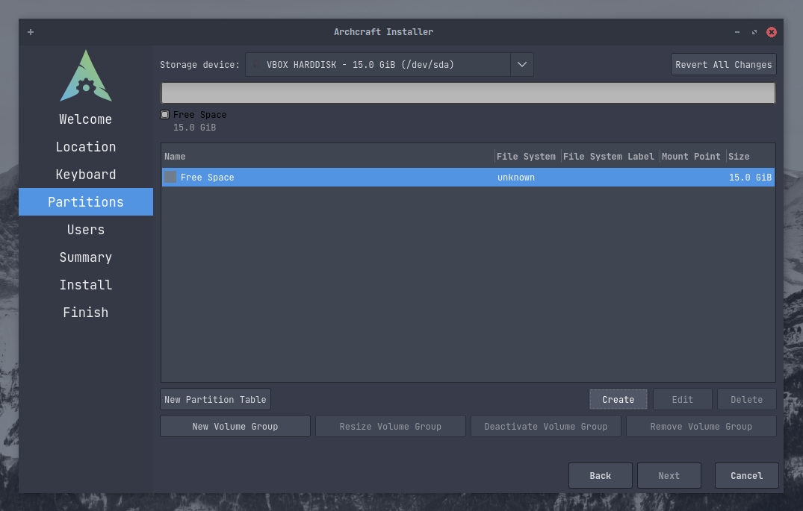

# 使用 Calamares 安装 Archcraft

这是一个简单的指南，供 Linux 初学者在他们的系统上安装 Archcraft。

本指南将使用 UEFI 引导安装 Archcraft。如果您使用的是 BIOS 引导，过程也是相同的。
按照以下步骤安装 Archcraft。

假设你已经用 Archcraft ISO 创建了一个 USB 引导设备，并且用它启动系统并选择 Boot Archcraft，
也启动了 Archcraft 安装程序

### 准备

选择安装过程中想要使用的语言， 点击<kbd>下一步</kbd>
:::note

印象中，镜像没有内置中文字体。如果选择了中文之后显示为方框，需要执行下面命令安装中文字体
```bash
$ sudo pacman -S wqy-zenhei
```

:::


选择 **地区**, **时区**, **Locale** 等，然后单击 <kbd>下一步</kbd> `如果你连接了网络，这里系统会自动选择，不需要手动更改`
:::note

Locale 决定了软件使用的语言、书写习惯和字符集。

:::


根据你的键盘，选择 **键盘布局** ，然后点击 <kbd>下一步</kbd> `一般，键盘的布局会自动根据你选择的 Locale 自动确定`


### 分区

:::note

**在这份指南中，所有的分区操作都是在一个空磁盘上进行的**

:::

**最可怕** 的部分来了，对于 Linux 初学者很有可能在这里出问题。所以建议你在对系统进行任何分区操作之前真正了解自己每一步操作会有什么结果。

如果你要在Virtualbox（在新创建的虚拟机上）上安装 Archcraft ，你可以选择 `Erase disk`。但是在真正的机器上，最好不要这么做（除非你决定完全擦除你的系统），推荐你使用手动分区。在本指南中，我们也会这样做。

点击勾选 `Manual Partitioning` ，然后点击 <kbd>下一步</kbd>


在这里，可以看到磁盘完全是空的（但在你的设备中，可能会在这里看到一堆分区）。我们先创建一个分区表。对于 UEFI，使用 `GPT` 分区表，对于 BIOS，使用 `MBR`分区表
> *如果你的磁盘已经有分区，则不需要创建分区表，这个操作仅适用于空磁盘*.


分区表创建完成之后，你就可以看到你磁盘上所有的空闲分区。 现在点击 <kbd>Create</kbd> 创建分区。



这次安装，我们准备创建三个磁盘分区 :
- `boot` : /boot/efi
- `root` : /
- `home` : /home

同时，你也可以（*也应该*）创建一个 **swap** 分区，这里不详细说明。

在 **UEFI 系统**中, 想要正常启动操作系统有一个额外的分区（*EFI*）是必要的。但是如果你想要使用 BIOS 引导操作系统, 就可以不创建 `boot` 分区。

:::danger

你的电脑磁盘可能已经有了一个 **EFI** 分区。这种情况下 **`不要格式化EFI分区`** ，否则你可能无法正常使用你已经安装了的其他操作系统（没错，说的就是Windows）

你只需要把EFI分区挂载到 `/boot/efi` 下。

:::

:::caution

确保你的EFI分区至少有` 100MB 剩余空间`，否则 Archcraft 安装可能会失败。

:::

因为在指南中我们使用的空白磁盘，所以我们需要创建一个EFI分区。下图中，我们了创建一个 **fat32** 格式，大小为 `300MB` 的分区。然后将这个分区挂载到`/boot/efi` 路径下，并标记为 **boot** 分区。


现在创建一个 `root` 分区。再次选中可用空间并单击<kbd>Create</kbd>。
选择 `root` 分区的大小（确保 `root` 分区大小至少为 10GB），磁盘格式（如果您不在乎，请使用 ext4 ）。将其挂载到 `/`并将标志设置为 root 分区，你还可以选择为文件系统设置标签，如果要使用加密，请选中加密框（Encrypt）并设置密码。


最后，创建 `home` 分区并挂载到 `/home`下。


这是预计系统安装之后硬盘的分区结果。确定一切正常后，点击 <kbd>下一步</kbd>


### 最后

创建一个用户，填完之后点击 <kbd>下一步</kbd>


这是安装的摘要，记录了你进行了哪些更改以及安装程序现在将要执行的操作。仔细检查一下，没问题就点击 <kbd>下一步</kbd> 进行安装


到此，就正式开始写入系统了，可能会花费几分钟...


完成之后，勾选 `Reboot now` 就可以立即重启系统。


** Archcraft 安装完成，尽情享受吧！ **
